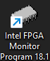
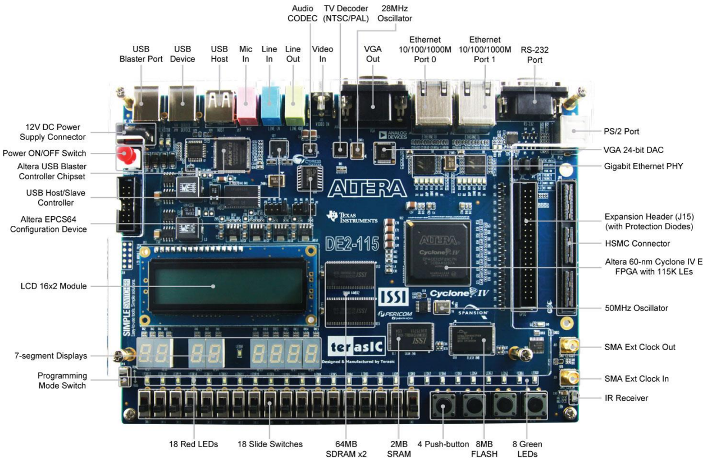
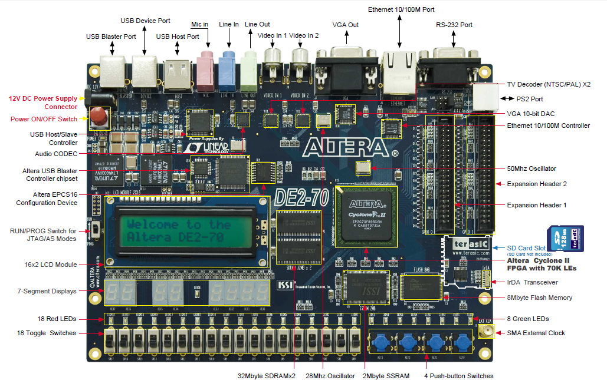
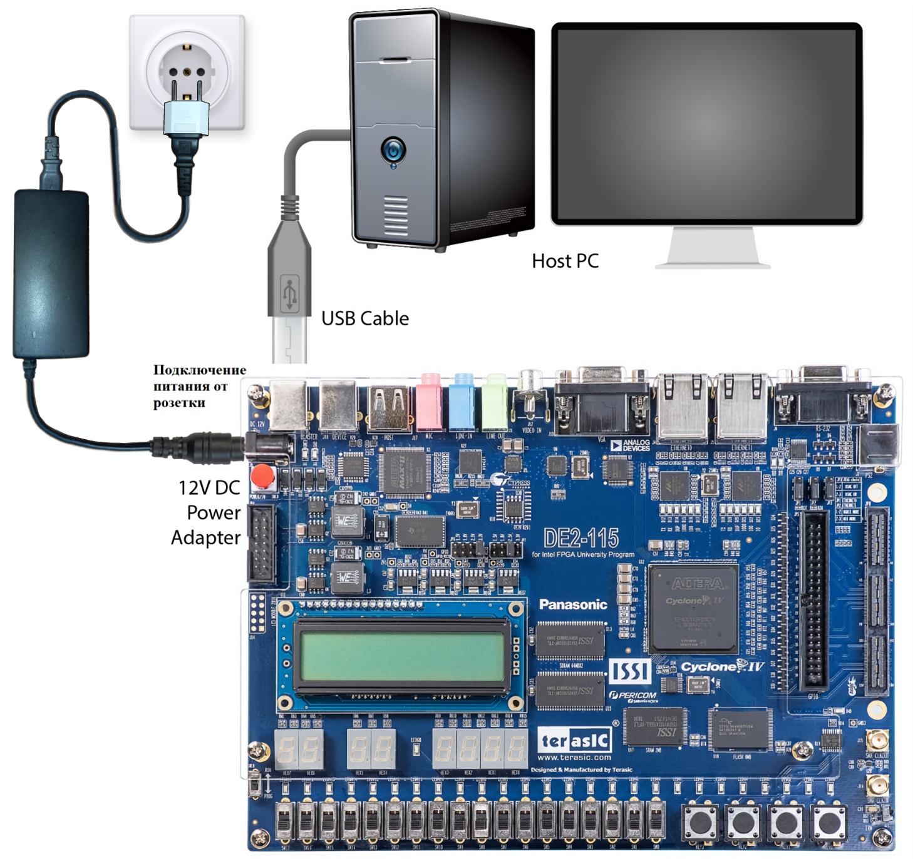

# Учебно-отладочный стенд «Intel DE 2-115». Приложение Intel Monitor Program (IMP) для работы со стендом

## Содержание

- [Цель работы](#цель-работы)
- [Объекты изучения](#объекты-изучения)
- [Планируемые результаты обучения](#планируемые-результаты-обучения)
- [Используемые файлы](#используемые-файлы)
- [Подготовка к лабораторной работе](#подготовка-к-лабораторной-работе)
- [Вопросы для самоконтроля](#вопросы-для-самоконтроля)
- [Порядок выполнения лабораторной работы](#порядок-выполнения-лабораторной-работы)
- [Отчетные материалы](#отчетные-материалы)
- [Защита лабораторной работы](#защита-лабораторной-работы)
- [Приложения](#приложение-а-иллюстрации)

## Цель работы

Приобретение навыков, необходимых для выполнения лабораторных работ по
дисциплине «Организация ЭВМ и систем» с использованием стендов Intel DE
2-115 с помощью приложения Intel Monitor Program (IMP).

Научиться использовать в своих проектах кнопочные и ползунковые
переключатели, светодиоды и HEX индикаторы, входящие в состав стенда.

## Объекты изучения

- учебно-отладочный стенд Intel DE 2 -115;

- приложение Intel Monitor Program, для работы со стендом;

- процессорная система DE 2-115 Media Computer и её периферийные
  устройства:

  - ползунковые переключатели;

  - кнопочные переключатели;

  - красные и зеленые светодиоды;

  - HEX индикаторы, входящие в состав стенда.

## Планируемые результаты обучения

После выполнения этой работы студенты будут **знать:**

- Какие компоненты включены в состав учебно-отладочного стенда DE2-115 и
  с какой целью;

- Какие из них используются в процессорной системе DE 2-115 Media
  Computer.

- Какие ресурсы содержатся в кристалле ПЛИС, входящем в состав стенда.

**смогут:**

- Подключать учебно-отладочный стенд DE 2-115 к инструментальному
  компьютеру и работать с ним, используя приложение IMP;

- Создавать новые проекты в приложении IMP;

- Загружать процессорную систему в кристалл ПЛИС стенда;

- Использовать программные компоненты в процессорной системе;

- Выполнять их компиляцию и загрузку в оперативную память процессорной
  системы;

- Определять состояния кнопок и ползунковых переключателей и управлять
  индикаторами, входящими в состав стенда.

  **приобретут навыки:**

- по созданию новых проектов в приложении IMP;

- выбору для них подходящей процессорной системы;

- добавления программных компонентов в проект;

- использования в проектах простейших устройств индикации, ползунковых и
  кнопочных переключателей.

## Используемые файлы

Файлы, используемые в работе, входят в состав приложения IMP. Для
процессорной системы DE 2-115 Media Computer это следующие файлы:
**nios_system.sopcinfo** и **DE2-115_Media_Computer.sof**. Первый из них
содержит перечисление компонентов процессорной системы с указанием их
особенностей и адресов. Второй файл является конфигурационным файлом, то
есть используется для прошивки кристалла ПЛИС стенда.

Третий файл **test_Media_Computer.s** содержит программу тестирования
процессорной системы. Основная её часть с подробными комментариями
приведена в [листинге 1](#листинг-1-фрагмент-файла-test_mediacomputers) в приложении Б и вынесена в файл [`listings/test_Media_Computer.s`](./listings/test_Media_Computer.s).

В [листинге 2](#листинг-2-файл-address_maps) представлено содержимое файла **address_map.s**. Полный фрагмент вынесен в файл [`listings/address_map.s`](./listings/address_map.s). В нём можем видеть поименованные константы с адресами
периферийных устройств и компонентов ОП.

## Подготовка к лабораторной работе

Ознакомьтесь с описанием стендов [\[1,2,3\]](#bibliography). В
Приложении А приводятся их фотографии и схема подключения стендов к сети
питания и к инструментальному компьютеру. Включите в отчет краткое
описание основных компонентов, содержащихся в стендах.

1.  Изучите описание кристаллов ПЛИС, входящих в состав стендов
    [\[4,5\]](#bibliography). Включите в отчет описание основных
    ресурсов кристалла.

2.  Изучите описание приложения Intel Monitor Program. Включите в отчет
    основные команды для настроек аппаратной части процессорной системы,
    выбора программных компонентов, настроек памяти процессорной
    системы, конфигурирования кристалла, а также для компиляции,
    загрузки и отладки программ, выполняющихся на реализованной в стенде
    процессорной системе.

3.  Ознакомьтесь с описанием процессорной системы DE 2-115 Media
    Computer [\[6,7,3\]](#bibliography). Поместите в отчет карту её
    памяти.

4.  Изучите структуру и принцип работы параллельных портов ввода вывода,
    используемых в процессорной системе для подключения красных и
    зеленых светодиодов, HEX индикаторов, кнопочных и ползунковых
    переключателей.

5.  Уясните пункты задания, выполняемого в лабораторной работе.

6.  Уясните логику работы программы тестирования процессорной системы.
    Её текст представлен в [листинге 1](#листинг-1-фрагмент-файла-test_mediacomputers) в приложении Б.

## Вопросы для самоконтроля

1.  Какие компоненты входят в состав учебного стенда?

2.  Каким образом выполняется конфигурирование кристалла ПЛИС учебного
    стенда?

3.  Какие компоненты учебного стенда входят в состав процессорной
    системы, используемой в лабораторных работах?

4.  Для чего предназначено приложение «Intel Monitor Program»?

5.  Каковы возможности приложения IMP?

6.  Что представляет собой проект в IMP?

7.  Как выбрать процессорную систему для использования в проекте?

8.  Как добавить программные файлы в проект?

9.  Как загрузить конфигурационный файл в кристалл ПЛИС учебного стенда?

10. Как выполнить компиляцию исходного файла программы?

11. Как загрузить исполняемый файл в оперативную память процессорной
    системы?

12. Какие компоненты памяти используются в процессорной системе?

13. Какие устройства ввода/вывода используются в процессорной системе?

14. Как называется процессор, используемый в процессорной системе? К
    какому типу архитектуры системы команд (АСК) он относится?

15. Как посмотреть содержимое ячеек памяти, портов ввода/вывода
    процессорной системы с помощью приложения IMP?

16. Можно ли изменять содержимое ячеек памяти, портов ввода/вывода
    процессорной системы с помощью приложения IMP? И если да, то как?

17. Какие формы используются в IMP для отображения содержимого ячеек
    памяти, портов ввода/вывода процессорной системы?

18. Можно ли инициализировать область ОП в заданном диапазоне? И если
    да, то как это сделать?

19. Что представляет собой параллельный порт ввода/вывода? Для
    взаимодействия с какими периферийными устройствами в процессорной
    системе он используется.

20. Можно ли вывести на 7-сегментные индикаторы цифры шестнадцатеричной
    системы счисления и как это сделать?

21. Какое количество красных и зеленых светодиодов используется в
    процессорной системе? Как ими управлять?

22. Какое количество кнопочных переключателей используется в
    процессорной системе?

23. Для чего предназначена кнопка KEY0?

## Порядок выполнения лабораторной работы

### Часть 1. Подключение стенда и запуск приложения IMP

1.  Подключите стенд к сети питания с переменным напряжением 220 вольт,
    используя верхний штырьковый разъем на левой стороне стенда и
    соответствующий кабель, входящий в комплект поставки стенда.

2.  Подключите стенд к инструментальному компьютеру, используя крайний
    слева разъем USB (типа В) на верхней стороне стенда и
    соответствующий кабель, входящий в комплект поставки стенда. Схема
    подключения показана на [рис 1.3 приложения А.](#ПриложениеВ)

3.  Подайте питание в стенд, нажав красную кнопку в верхней левой части
    стенда.

4.  Запустите приложение Intel Monitor Program, используя ярлык
    на рабочем столе
    инструментального ПК.

### Часть 2. Создание нового проекта в IMP

1.  В меню File приложения IMP выполните команду New Project. Появится
    окно New Project Wizard. Задайте в нем имя рабочей папки, в которой
    будет храниться проект и имя проекта. Папка предварительно должна
    быть создана. Следует напомнить, что для корректной работы
    приложения надо избегать в названии пути к созданной папке
    русскоязычных символов. Для перехода к следующему окну нажмите Next.

2.  В появившемся окне следует выбрать процессорную систему. Для этого в
    поле Select a system щелкните мышью по значку раскрытия списка. В
    появившемся списке выберите «DE2-70 Media Computer» или «DE2-115
    Media Computer». Обратите внимание, после выбора процессорной
    системы становится активной кнопка «Documentation», размещенная
    правее, с помощью которой можно открыть pdf файл с описанием
    процессорной системы [\[6,7,3\]](#bibliography) от производителя.
    Если в проекте будет использоваться самостоятельно спроектированная
    процессорная система, то в этом случае следует выбрать Custom
    system.

3.  В полях System Details появятся названия файлов для конфигурирования
    процессорной системы, если в предыдущем пункте была выбрана заранее
    спроектированная процессорная система из предложенного списка.
    Первый из них, nios_system.sopcinfo содержит описание процессорной
    системы. В нём перечислены компоненты процессорной системы с
    указанием их типов и адресов. Второй файл с расширением .sof
    является конфигурационным файлом, то есть используется для прошивки
    кристалла ПЛИС стенда. В случае использования специализированной
    процессорной системы эти поля следует заполнить самостоятельно,
    указав места размещения соответствующих файлов. Для перехода к
    следующему окну нажмите кнопку Next.

4.  В появившемся окне следует определить тип используемой программы.
    Для этого в поле Program Type в предложенном списке выберите тип
    Assembly Program. Используйте опцию Include a sample program with
    the project для включения в следующее поле названий образцов
    программ. Выберите в этом поле программу Test_Media_Computer. Для
    перехода к следующему окну нажмите кнопку Next.

5.  В следующем окне следует определить исходные файлы используемой в
    проекте программы. Если в предыдущем пункте была выбрана программа
    из предложенных образцов, то это поле будет заполнено автоматически.
    Если в предыдущем пункте не использовалась опция включения образцов
    программ, то в поле Source files следует добавить имена исходных
    файлов. Для этого можно использовать кнопку Add. В случае выбора
    нескольких исходных файлов их компиляция будет выполняться в том же
    порядке, что и в списке, а результирующему исполняемому файлу будет
    присвоено имя первого файла в списке. В разделе Program options в
    поле Start symbol следует указать имя метки первой выполняемой
    команды программы. Для перехода к следующему окну нажмите Next.

6.  В появившемся окне следует определить параметры системы. Если
    используется один программатор, то поля Host сonnection и Processor
    будут заполнены автоматически. В противном случае эти поля следует
    заполнить самостоятельно. В поле Terminal Device следует указать
    JTAG_UART. Это будет означать, что в качестве терминального
    устройства будет использоваться соответствующее окно IMP. Для
    перехода к следующему окну нажмите кнопку Next.

7.  В следующем окне надо определить установки памяти процессорной
    системы. По умолчанию Reset vector address равен 0, а Exception
    vector address устанавливается равным 0х20. Если эти адреса должны
    быть изменены, то их следует задать при сборке процессорной системы
    в приложении Platform Designer (PD).

8.  Далее в разделе Memory options следует указать, какая память будет
    использоваться для загрузки программ и данных. В поле .text sections
    следует задать память SDRAM/s1, в поле Start offset in device
    следует задать значение 0х400. Это значит, что секция кода будет
    размещена в динамической памяти, с адреса 0х400. В поле .data
    sections также следует задать память SDRAM/s1, а в поле Start offset
    in device следует задать значение 0х400. В случае если использована
    одна и та же память для размещения секции кода и данных, секция
    данных будет размещена сразу же после секции кода. Для завершения
    работы New Project Wizard нажмите кнопку Finish.

### Часть 3. Реализация процессорной системы в учебном стенде, загрузка и выполнение тестовой программы

1.  Если в предыдущих пунктах была выбрана процессорная система из
    предложенного списка, то появится окно, предлагающее выполнить
    загрузку конфигурационного файла для процессорной системы в кристалл
    ПЛИС. В противном случае, для загрузки конфигурационного файла
    следует воспользоваться командой Programmer из меню Tools пакета
    Quartus II [\[8,9\]](#bibliography). Процесс конфигурирования
    кристалла сопровождается свечением голубого светодиода в левой
    верхней части стенда, а загорание второго голубого светодиода
    означает успешное завершение процесса конфигурирования кристалла.

2.  Чтобы загрузить программу в память процессорной системы, в основном
    окне IMP следует выполнить команду Actions \> Compile & Load или
    использовать пиктограмму
     на панели инструментов
    Убедитесь, что в основном окне IMP во вкладке *Disassembly*
    появилась выбранная в пункте 2.5 программа. Причем желтым цветом
    будет выделена первая её команда, помеченная меткой_start. В нашем
    случае, это будет команда с адресом 0х400. Наблюдайте также, что
    значение PC (program counter) в окне отображения и редактирования
    регистров будет равно 0х400.

3.  Чтобы запустить программу выполните команду Actions\> Continue или
    используйте пиктограмму
     на панели инструментов.
    Проверьте правильность выполнения программы.

4.  Если была запущена программа Test Media Computer, то она выполняет
    следующее.

5.  Тестирует статическую память. Тестирование заключается в заполнении
    оперативной памяти значениями 0х55555555. Каждый цикл записи
    сопровождается считыванием записанной информации и сравнением с
    эталоном. Затем число-заполнитель меняется на инверсное значение, и
    цикл тестирования продолжается.

6.  Отображает бегущую строку на 7-сегментном дисплее. Если ошибок при
    тестировании статической памяти не обнаружено, то строка содержит
    слова "dE2" и "PASSEd". Если будут обнаружены ошибки, то выведется
    слово "Error".

7.  Включает мерцание зеленых светодиодов. Скорость мерцания светодиодов
    и прокрутки текста на 7-сегментных индикаторах регулируется
    прерываниями от таймера.

8.  Подключает переключатели к красным светодиодам.

9.  Обрабатывает прерывания от кнопок. Нажатие кнопки KEY1 увеличивает
    скорость прокрутки строки. Нажатие кнопки KEY2 снижает скорость,
    нажатие кнопки KEY3 - останавливает прокрутку.

10. Тестирует порт расширения JP1, если установлены соответствующие
    перемычки.

11. Принимает данные, вводимые в терминальное окно IMP, и отсылает их
    обратно, используя интерфейс JTAG UART, и дополнительно пересылает
    их в com порт.

12. Попробуйте двигать ползунковые переключатели в нижней части стенда.
    Наблюдайте, к каким изменениям в работе стенда это приводит.
    Отразите в отчете.

13. Экспериментально определите, к каким изменениям приводит нажатие
    кнопок KEY1, KEY2, KEY3. Поместите в отчет ваши наблюдения.

14. Установите курсор мыши в терминальное окно IMP в левой нижней части
    экрана. Наберите в этом окне вашу фамилию, имя и отчество, используя
    символы латинского алфавита. Отразите ваши наблюдения в отчете.

15. Остановите выполнение программы. Для этого выполните команду Actions
    \> *Stop* или используйте пиктограмму
     на панели инструментов
    IMP. К каким изменениям в работе стенда это привело?

16. Выполните несколько команд программы по шагам, используя команду
    Actions \> Single Step или используйте пиктограмму
     на панели инструментов
    IMP. Выполняемая команда будет выделена во вкладке *Disassembly*
    желтым цветом. Наблюдайте происходящие изменения в регистровом окне
    приложения. Поместите в отчет выполненные по шагам команды и опишите
    произведенные ими действия.

17. Попробуйте изменить содержимое РС в регистровом окне IMP. Наблюдайте
    соответствующие изменения во вкладке *Disassembly*. Зафиксируйте в
    отчете ваши наблюдения.

18. Выполните двойной щелчок левой кнопкой мыши по некоторой команде во
    вкладке *Disassembly*. Посмотрите к каким изменениям в открытой
    вкладке и в регистровом окне приведет это действие. Отразите в
    отчете ваши наблюдения.

19. Попробуйте перезапустить программу. Для этого выполните команду
    Actions\> Restart или используйте пиктограмму
     на панели инструментов.
    Обратите внимание на то, что данная команда только изменяет значение
    счетчика команд на адрес начала программы. Убедитесь, что это
    произошло.

20. Продолжите выполнение программы, используя
    пиктограмму на панели инструментов.

### Часть 4. Использование приложения IMP для работы с портами ввода-вывода процессорной системы

1.  Остановите выполнение программы.

2.  Откройте вкладку *Memory* основного окна IMP. Для перехода к нужному
    адресу можно воспользоваться полем Go в верхней части окна.
    Наблюдайте состояние переключателей и кнопок стенда, обращаясь к
    соответствующим портам ввода. Для этого включите опцию Query All
    Devices, используя соответствующее поле в верхней части окна IMP, и
    после изменения состояния переключателей и кнопок нажмите кнопку
    Refresh Memory в верхней правой части окна IMP.

3.  С помощью правой кнопки мыши вызовите контекстное меню в открытой
    вкладке и изучите его содержимое. Попробуйте отобразить содержимое
    портов и ОП по байтам, по полусловам и словам. Меняйте количество
    столбцов с выводимой информацией на экране и сам формат выводимых
    данных, порядок отображения в окне, слева направо, и справа налево.
    Экспериментально определите, к каким результатам приводит выполнение
    других команд из контекстного меню.

4.  Управляйте зелеными и красными светодиодами, записывая по
    соответствующим адресам портов вывода различные наборы данных.
    Уясните принцип управления светодиодами.

5.  Управляйте сегментами индикаторов шестнадцатеричной цифры, подавая
    различные наборы данных в соответствующие порты вывода данных.
    Уясните принцип работы индикаторов и отобразите его в отчете.

6.  Сформируйте наборы данных таким образом, чтобы на HEX индикаторах
    высветилась дата вашего рождения в формате дд.мм.гггг. Зафиксируйте
    в отчете выводимые в соответствующие порты наборы данных и фото
    отображаемой на индикаторах даты.

## Отчетные материалы

Отчетные материалы должны содержать:

1.  Цель лабораторной работы.

2.  Материалы, связанные с подготовкой к работе, включая теоретическую
    часть и исходные заготовки программ.

3.  Информацию по выполнению каждого пункта задания. Причем в отчете
    должны содержаться выполняемые вами действия, наблюдаемые
    результаты, подтверждаемые снимками экрана инструментального ПК или
    фотографиями стенда, и ваши объяснения.

4.  Краткое заключение.

## Защита лабораторной работы

На защите работы студенты должны демонстрировать знания, умения и
навыки, перечисленные в разделе «Планируемые результаты обучения».

Студенты должны уметь:

- Подключать стенд к инструментальному компьютеру и использовать
  приложение IMP для работы с ним;

- Создавать новые проекты;

- Выбирать для них подходящую процессорную систему из предложенного
  списка;

- Загружать процессорную систему в кристалл ПЛИС учебного стенда;

- Добавлять к проекту новые программные компоненты;

- Компилировать и загружать программу в ОП процессорной системы;

- Использовать вкладку *Disassembly* для управления программой;

- Запускать программу, останавливать, выполнять её по шагам и
  перезапускать повторно;

- Использовать вкладку *Memory* для наблюдения состояния периферийных
  устройств ввода, таких как ползунковые и кнопочные переключатели и
  управлять устройствами вывода, красными, зелеными светодиодами и HEX
  индикаторами;

- Показывать на стенде, какие компоненты в него входят, и как они
  используются в лабораторной работе.

## Приложение А. Иллюстрации

Внешний вид стендов DE2-115 и DE2-70 приведен на [рис.
1.1](#_Ref157706698) и [рис. 1.2](#_Ref159165376), соответственно.



*Рис. 1.1 – Внешний вид
стенда DE2-115*



*Рис. 1.2 – Внешний вид
стенда DE2-70*



*Рис. 1.3 - Схема подключения стенда к сети питания и ПК*

## Приложение Б. Листинги кода

### Листинг 1. Фрагмент файла `test_Media_Computer.s`

Файл вынесен отдельно: [`listings/test_Media_Computer.s`](./listings/test_Media_Computer.s).

```asm
.include "address_map.s"
.equ RIBBON_CABLE_INSTALLED, 0

/* Программа демонстрирует возможности процессорной системы.
Она выполняет следующие действия:
1. Тестирует статическую память.
2. Прокручивает текст на 7-сегментном дисплее. Если ошибок при тестировании
   статической памяти не обнаружено, то текст содержит слова "dE2" и "PASSEd".
   Если были обнаружены ошибки, то выводится слово "Error".
3. Мигает зелеными светодиодами. Скорость мигания светодиодов и прокрутки текста
   на 7-сегментных индикаторах регулируется кнопками.
4. Подключает переключатели к красным светодиодам.
5. Обрабатывает прерывания от кнопок. Нажатие KEY1 увеличивает скорость
   прокрутки текста. Нажатие KEY2 снижает скорость, KEY3 останавливает прокрутку.
6. Тестирует порты расширения JP1, JP2.
7. Отсылает в терминальное окно IMP инструментального ПК данные, полученные
   по интерфейсу JTAG UART.
*/

.text
.global _start
_start:
    /* инициализируем регистры sp и fp */
    movia   sp, 0x07FFFFFC      # Стек начинается с адреса последнего слова SDRAM
    mov     fp, sp

    /* инициализируем буфер 7-сегментных индикаторов */
    movia   r16, DISPLAY_BUFFER
    movi    r17, 0xde2
    stw     r17, 0(r16)
    stw     zero, 4(r16)
    stw     zero, 8(r16)

    /* инициализируем зеленые светодиоды */
    movia   r2, 0x55555555
    movia   r16, GREEN_LED_PATTERN
    stw     r2, 0(r16)

    /* инициализируем счетчик задержки */
    movia   r16, EIGHT_SEC
    stw     zero, 0(r16)

    /* инициализируем переключатели */
    movia   r16, DISPLAY_TOGGLE
    stw     zero, 0(r16)

    /* направление передачи: 0 - влево, 1 - вправо */
    movi    r2, 1
    movia   r16, SHIFT_DIRECTION
    stw     r2, 0(r16)

    /* запускаем таймер и разрешаем его прерывания */
    movia   r16, INTERVAL_TIMER_BASE
    movi    r15, 0b0111         # START = 1, CONT = 1, ITO = 1
    sthio   r15, 4(r16)

    /* разрешаем прерывания от кнопок KEY3, KEY2, KEY1 */
    movia   r16, PUSHBUTTON_BASE
    movi    r15, 0b01110        # устанавливаем биты маски прерывания в 1
    stwio   r15, 8(r16)         # заносим в регистр маски

    /* разрешаем прерывания процессора от кнопок и таймера */
    movi    r15, 0b011
.if RIBBON_CABLE_INSTALLED
    ori     r15, r15, 0b1000000000000 # также разрешаем прерывания для JP2
.endif
    wrctl   ienable, r15
    movi    r15, 1              # разрешаем прерывания текущей программы
    wrctl   status, r15

    /* цикл тестирования статической памяти и обновления HEX-индикаторов */
    movia   r15, 0x55555555
    movia   r17, SRAM_END

DO_DISPLAY:
    movia   r16, SRAM_BASE
    movia   r17, SRAM_END

MEM_LOOP:
    call    UPDATE_HEX_DISPLAY
    call    UPDATE_RED_LED
    call    UPDATE_UARTS

.if RIBBON_CABLE_INSTALLED
    call    TEST_EXPANSION_PORTS
    beq     r2, zero, SHOW_ERROR
.endif

    stw     r15, 0(r16)
    ldw     r14, 0(r16)
    bne     r14, r15, SHOW_ERROR
    addi    r16, r16, 4
    ble     r16, r17, MEM_LOOP

    xori    r15, r15, 0xFFFF
    xorhi   r15, r15, 0xFFFF

    /* меняет буфер 7-сегментных индикаторов приблизительно каждые 8 секунд */
    movia   r16, EIGHT_SEC
    ldw     r17, 0(r16)
    movi    r14, 80
    ble     r17, r14, DO_DISPLAY
    stw     zero, 0(r16)

    /* toggle display of dE2 and PASSEd */
    movia   r16, DISPLAY_TOGGLE
    ldw     r17, 0(r16)
    beq     r17, zero, SHOW_PASSED
    stw     zero, 0(r16)

    /* показать "dE2" */
    movia   r16, DISPLAY_BUFFER
    movi    r17, 0xdE2
    stw     r17, 0(r16)
    stw     zero, 4(r16)
    stw     zero, 8(r16)
    br      DO_DISPLAY

SHOW_PASSED:
    movi    r17, 1
    stw     r17, 0(r16)
    movia   r16, DISPLAY_BUFFER
    movia   r17, 0xbA55Ed
    stw     r17, 0(r16)
    stw     zero, 4(r16)
    stw     zero, 8(r16)
    br      DO_DISPLAY

SHOW_ERROR:
    movia   r16, DISPLAY_BUFFER
    movia   r17, 0xe7787
    stw     r17, 0(r16)
    stw     zero, 4(r16)
    stw     zero, 8(r16)

DO_ERROR:
    call    UPDATE_HEX_DISPLAY
    br      DO_ERROR
```

### Листинг 2. Файл `address_map.s`

Файл вынесен отдельно: [`listings/address_map.s`](./listings/address_map.s).

```asm
.equ SRAM_BASE,          0x8000000
.equ SRAM_END,           0x81FFFFF
.equ RED_LED_BASE,       0x10000000
.equ GREEN_LED_BASE,     0x10000010
.equ HEX3_HEX0_BASE,     0x10000020
.equ HEX7_HEX4_BASE,     0x10000030
.equ SLIDER_SWITCH_BASE, 0x10000040
.equ PUSHBUTTON_BASE,    0x10000050
.equ JP1_EXPANSION_BASE, 0x10000060
.equ JP2_EXPANSION_BASE, 0x10000070
.equ JTAG_UART_BASE,     0x10001000
.equ UART_BASE,          0x10001010
.equ INTERVAL_TIMER_BASE,0x10002000
```


## Список источников

> В исходном DOCX ссылки обозначены номерами `[1]` - `[9]`, но сами URL и библиографическое описание в файле отсутствуют. Перед публикацией замените этот блок на реальные источники или добавьте отдельный файл `references.md`.
