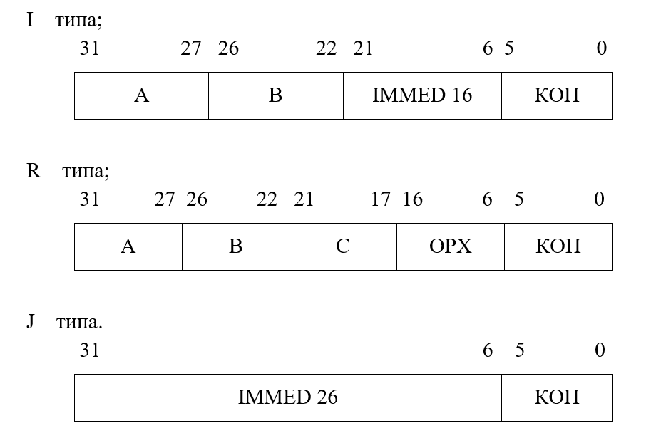
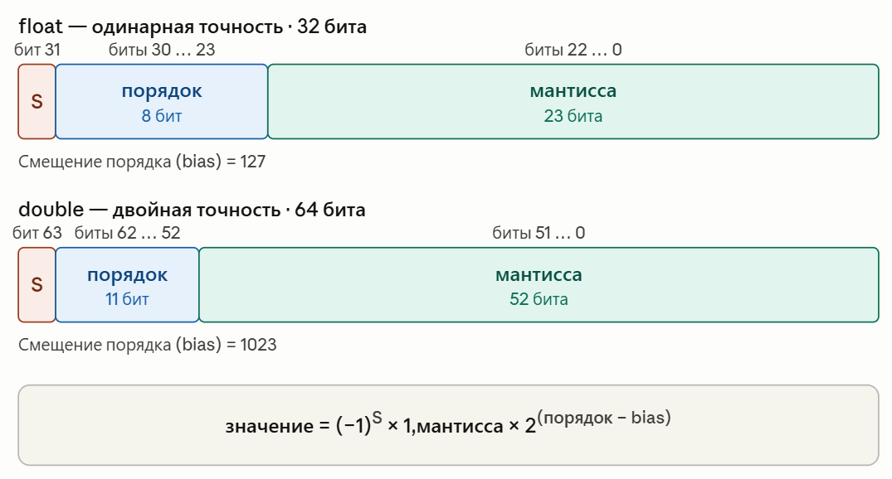
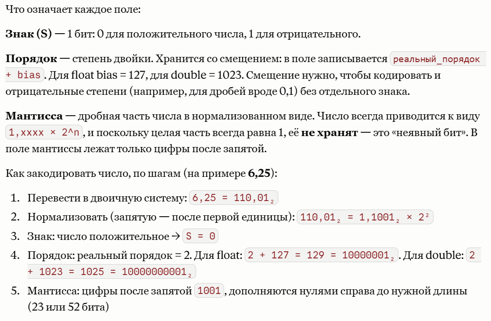
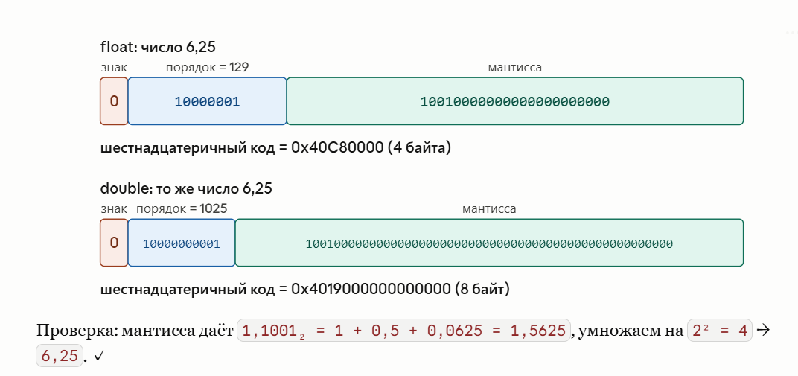

# Лабораторная работа 2. Архитектура системы команд процессора NIOS II

## Цель работы

Изучение архитектуры системы команд (АСК) процессора NIOS II, приобретение навыков создания новых программных компонентов и их отладки.

## Объекты изучения

- Архитектура системы команд процессора NIOS II:
  - типы и форматы его команд;
  - используемые способы адресации операндов;
  - форматы представления числовой информации;
  - форматы представления символьной информации.
- Директивы ассемблера определения секций, управления программным указателем, определения данных.
- Приложение Intel Monitor Program для работы со стендом, по части его использования для добавления новых программных компонентов, их компиляции, загрузки в ОП и отладки.

## Планируемые результаты обучения

После выполнения этой работы студенты будут знать:

- типы и форматы команд процессора NIOS II;
- типы и форматы операндов;
- способы адресации операндов;
- директивы ассемблера определения секций, управления программным указателем, определения данных.

Смогут:

- создавать новые программные компоненты для процессорной системы и работать с ними;
- выполнять их компиляцию и загрузку в оперативную память процессорной системы, управляя их размещением в ОП;
- находить в ОП исполняемый код программы и отдельные её команды, исходные данные и их отдельные элементы;
- отлаживать программные компоненты, используя контрольные точки, выполнение по шагам и в автоматическом режиме.

Приобретут навыки работы:

- с учебным стендом;
- с приложением IMP;
- с процессорной системой, реализованной в кристалле ПЛИС учебного стенда.

## Файлы, используемые в работе

В работе используется файл [`lab_max.s`](listings/lab_max.s), в котором содержится программа нахождения наибольшего числа из списка.

## Подготовка к лабораторной работе

1. Изучите описание процессора NIOS II. Включите в отчет описание его регистровой структуры, типов используемых команд, их форматов и способов адресации операндов. Уясните, как выполняются команды условного перехода. Включите в отчет описание команд `bge` и `blt` вместе с их кодами операций.
2. Изучите описание процессорной системы DE2-115 Media Computer, реализованной в стенде. Включите в отчет структурную схему процессорной системы и карту памяти, на которой должны быть отражены адреса ОП и портов ввода-вывода периферийных устройств системы.
3. Изучите директивы ассемблера `.data`, `.text`, `.equ`, `.asciz`, `.word`, `.hword`, `.dword`, `.byte`, `.quad`, `.octa`, `.float`, `.double`, `.org`, `.end`, `.include`. Поместите их описания в отчетные материалы.
4. Уясните пункты задания, выполняемого в текущей лабораторной работе.
5. Уясните логику работы программы `lab_max`, нахождения наибольшего числа из списка. Выполните её редактирование для выполнения пункта 2.2 задания и подготовьте новые данные для тестирования программы, соответствующие индивидуальному варианту задания. Включите текст измененной программы с обновленными данными в отчет.
6. Выполните редактирование программы с целью нахождения минимального числа из списка с выводом его на зеленые светодиоды. Это пункт 2.7 задания. Поместите текст измененной программы в отчет.

## Вопросы для самоконтроля

1. Сколько регистров общего назначения имеется в процессоре NIOS II? Какова их разрядность?
2. Входят ли в состав процессора иные регистры, кроме регистров общего назначения?
3. Для чего они предназначены?
4. Можно ли видеть и изменять содержимое регистров процессора в IMP?
5. Какие из регистров общего назначения выполняют специальные функции?
6. Какой из регистров в процессорной системе указывает на текущую выполняемую команду? Можно ли его изменить, и если да, то как?
7. К какому типу АСК — RISC или CISC — относится процессор NIOS II? По каким признакам?
8. Типы и форматы команд процессора NIOS II?
9. Типы и форматы операндов?
10. Используемые в процессоре способы адресации операндов?
11. Какой код используется для представления чисел со знаком?
12. Какой код используется для представления символьной информации?
13. Какие директивы ассемблера используются для задания числовых операндов?
14. Какие директивы ассемблера используются для задания символьных операндов?
15. Какая директива ассемблера используется для задания констант?
16. Как выполнить компиляцию исходной программы и загрузить её исполняемый файл в память процессорной системы?
17. Какие возможности предоставляет IMP для отладки программы?
18. Что такое контрольная точка? Как её установить, удалить?
19. Можно ли загрузить исходные данные отдельно от кода программы и как это сделать?

## Порядок выполнения лабораторной работы

### Часть 1. Использование приложения IMP для компиляции, загрузки и отладки программы

1.1. В меню **File** откройте проект, созданный в первой лабораторной работе, используя команду **Open Project...** или **Open Recent Project**. Допускается также создание нового проекта, как это описано в предыдущей работе.

1.2. В меню **Settings** выполните команду **Program settings**. В появившемся окне в поле **Source files** удалите содержащиеся там файлы, если используете проект из первой работы, и выберите файл `lab_max.s` из папки «Исходные файлы к лабораторным работам», используя команду **Add**. Для завершения программных установок нажмите кнопку **ОК**.

1.3. Выполните компиляцию и загрузку новой программы, используя соответствующие команды IMP.

1.4. Найдите в ОП загруженную программу и исходные данные. Для этого используйте вкладку **Disassembly**. Отобразите в отчете диапазон адресов ОП, занятых программой, и диапазон адресов, где размещены данные. Отдельно укажите адреса команд с метками `_start`, `LOOP`, `STOP` и адрес команды `bge`.

1.5. Используя вкладку **Memory** основного окна IMP, найдите в оперативной памяти процессорной системы загруженную программу и данные с заданным списком чисел, в котором будет выполнен поиск максимального числа. Для наблюдения содержимого ячеек памяти воспользуйтесь командами из меню **View**. Задавайте разные значения количества отображаемых ячеек на строке экрана и разную форму представления содержимого памяти: двоичную, восьмеричную, шестнадцатеричную, десятичную со знаком и без знака. Сделайте снимок экрана, выделите на нем области кода и данных программы и поместите его в отчет.

1.6. Чтобы уяснить алгоритм программы поиска наибольшего числа из списка, начните её выполнять по шагам. Для этого используйте команду **Actions > Single Step** или пиктограмму на панели инструментов IMP. Наблюдайте результаты выполнения отдельных команд программы, используя окна отображения содержимого регистров процессора **Registers** и памяти **Memory**. Обратите внимание на то, как выполнена компиляция псевдокоманд. Отразите это в отчете.

1.7. После уяснения структуры программы установите контрольную точку в начало цикла — метка `LOOP`. Для этого щелкните мышью в поле слева от адреса команды. Контрольная точка отобразится кружком красного цвета. Чтобы удалить контрольную точку, выполните повторный щелчок по кружку. Выполните программу с использованием контрольной точки. После каждого останова программы наблюдайте содержимое изменяемых регистров процессора. Для продолжения выполнения программы используйте команду **Actions > Continue** или пиктограмму на панели инструментов IMP. Чтобы визуализировать момент завершения программы, рекомендуется поставить контрольную точку на последней команде с меткой `STOP`.

### Часть 2. Представление числовой информации в процессорной системе. Форматы команд

> В этой и в следующих лабораторных работах не следует вносить изменения в программные заготовки, предлагаемые студентам. Вначале необходимо сохранить их с новым именем, соответствующим вашей фамилии, а потом уже вносить изменения в программу.

2.1. Во вкладке **Memory** измените переменную `N`, задающую количество чисел в списке. Вместо первоначального значения `7` запишите новое значение `10`. Проанализируйте числа, которые хранятся в ячейках ОП и соответствуют обновленному списку чисел. Определите визуально максимальное число с учетом добавленных к прежнему списку новых чисел. Повторно выполните программу. Убедитесь, что полученный ею результат совпадает с ожидаемым. Если это не так, попробуйте найти объяснения. Поместите в отчет содержимое области данных в ОП и найденный результат.

2.2. Внесите изменения в программу таким образом, чтобы вывод найденного максимального числа осуществлялся на красные светодиоды. Для задания адреса соответствующего порта используйте символическое имя, например `LEDR`, и директиву `.equ`, в которой этому имени присваивается конкретное значение. Альтернативный вариант — использовать имя `RED_LED_BASE` из файла `address_map.s`, который должен быть добавлен к исходному файлу с помощью директивы `.include`.

2.3. Измените количество чисел в списке и сами числа таким образом, чтобы в результате выполнения программы загорались светодиоды в соответствии с заданным вариантом. Номер варианта определяется номером стенда, за которым выполняется лабораторная работа. Таблица 2.1 в приложении В содержит варианты заданий. Добавьте в список отрицательные числа в соответствии с вашим вариантом. Наблюдайте во вкладке **Memory**, как они будут представлены в ОП процессорной системы. Поместите в отчет листинг изменённой программы с обновленным списком чисел, представление списка в ОП во вкладке **Memory** и фото загораемых светодиодов.

2.4. Найдите в ОП команду условного перехода `bge` на метку `LOOP`. Исследуйте её машинный код. Для этого воспользуйтесь вкладкой **Memory**. Используйте двоичную форму представления содержимого ячеек памяти. Скопируйте бинарный код команды в любой текстовый редактор. Определите формат команды. Выделите отдельные поля команды и осмыслите их содержимое, включая поле `Immed16`, которое соответствует разрядам с 6 по 21 команды. Нумерация разрядов начинается с нулевого и ведется справа налево. Убедитесь, что в мнемоническом представлении команды во вкладке **Disassembly** используется именно такое смещение. Уясните, как выполняется эта команда.

2.5. Найдите в программе другие команды условного и безусловного переходов. Определите формат одной из них в соответствии с индивидуальным вариантом задания из таблицы 2.1 и осмыслите значение поля `Immed16`. Как оно зависит от направления перехода? Отразите это в отчете.

2.6. Измените содержимое поля кода операции команды — разряды с 0 по 5, рассмотренной в предыдущем пункте, — на значение `0x16`. Оно соответствует команде `blt`. Обратите внимание на то, что изменения не отражаются во вкладке **Disassembly**. Выполните программу повторно. Наблюдайте результат. Включите в отчет фото выводимого на светодиоды результата и ваши комментарии.

2.7. Внесите изменения в исходный код программы так, чтобы вновь найденное число выводилось на зеленые светодиоды, сохраните эту программу с другим именем.

2.8*. Внесите изменения в программу таким образом, чтобы она находила и максимальное и минимальное числа из списка и выводила их на красные и зеленые светодиоды соответственно.

2.9. Найдите в программе команды иного формата, чем команды перехода. Выполните их декодирование. Выделите у них отдельные поля и осмыслите их содержимое. Включите это в отчет.

### Часть 3. Представление символьной информации в процессорной системе

3.1. Добавьте в исходный код программы из пункта 2.3, после ячейки `N` и перед списком чисел, текстовую строку с вашей фамилией, именем и отчеством. Используйте для этого директиву `.asciz` и латинские символы. Возможно появление ошибок в процессе компиляции измененной программы. Попробуйте понять причину по сообщению компилятора и устраните её.

3.2. Скомпилируйте и загрузите изменённую программу в память процессорной системы. С помощью вкладки **Memory** найдите в ОП добавленную текстовую строку. Используйте побайтовое представление информации и команды из меню **View**, позволяющие отображать содержимое текстовых строк. Сделайте снимок экрана и поместите в отчет. Отразите местоположение текстовой строки и ASCII-коды используемых символов.

3.3. Попробуйте выполнить программу. Наблюдайте найденный ею результат на красных светодиодах. Корректно ли работает программа? Отразите это в отчете и укажите причину.

3.4. Выполните дополнительное редактирование программы так, чтобы она корректно работала с добавленной текстовой строкой, как и прежде. Запустите программу и покажите результат её работы преподавателю.

3.5. Можно ли вставить добавленную текстовую строку прямо в код программы, разместив её между командами? Попробуйте это сделать и результат работы программы покажите преподавателю. Поместите в отчет ваше заключение. Верните текстовую строку на прежнее место в программе.

### Часть 4. Раздельное размещение кода и данных в памяти процессорной системы

4.1. С помощью директивы `.data` локализуйте область данных программы в отдельной секции. Выполните еще раз компиляцию и загрузку программы. Наблюдайте, произошли ли изменения во вкладке **Disassembly**. Проверьте, используя вкладку **Memory**, изменилось ли место размещения кода программы и исходных данных в памяти процессорной системы. Отобразите это в отчете.

4.2. Экспериментально определите, как работает директива `.org`. Для этого в программу вставьте строку `.org 0x100` сначала перед директивой `.asciz`, а затем перед директивой `.data`. Отразите в отчете ваши наблюдения и сделанные выводы.

4.3. Удалите добавленную директиву `.org` из программы. Завершите сеанс работы с текущей программой, используя команду **Disconnect** из меню **Actions**. Выполните команду **Settings > Memory settings**. В появившемся окне в поле `.data sections` установите адрес, соответствующий начальному адресу статической памяти, используемой в процессорной системе.

4.4. Еще раз скомпилируйте и загрузите программу. Используя вкладку **Memory**, найдите в ОП место размещения исходных данных, включая текстовую строку с вашей фамилией, именем и отчеством. Сделайте снимок экрана и поместите его в отчет. Выполните программу. Наблюдайте выводимый программой результат.

### Часть 5. Форматы представления чисел

5.1. Внесите изменения в программу таким образом, чтобы заданные числа в списке были представлены в формате полуслов. Добавьте в список предельные значения чисел для этого формата, максимальные по модулю отрицательные и положительные числа.

5.2. Отладьте программу. Наблюдайте размещение исходных чисел в ОП и выводимый программой результат. Поместите в отчет листинг отлаженной программы, снимок ОП с размещённым списком чисел и фото загораемых светодиодов. Для вывода минимальных значений используйте измененную в пункте 2.7 программу.

5.3. Внесите изменения в программу таким образом, чтобы заданные числа в списке были представлены в формате байт. Добавьте в список предельные значения чисел для этого формата. Добейтесь правильного выполнения программы. Наблюдайте размещение исходных чисел в ОП и выводимый программой результат. Поместите в отчет листинг отлаженной программы, снимок ОП с размещённым списком чисел и фото загораемых светодиодов.

5.4*. Внесите изменения в программу таким образом, чтобы заданные числа в списке были представлены в формате двойных слов. Найденное максимальное число из списка поместите в два смежных регистра процессора. Добейтесь правильного выполнения программы. Наблюдайте размещение исходных чисел в ОП и найденный результат. Поместите в отчет листинг отлаженной программы, снимок ОП с размещённым списком чисел и содержимое регистров с найденным результатом.

5.5. Экспериментально определите, как работают директивы `.quad`, `.octa`. Для этого добавьте в секцию данных вашей программы дополнительные именованные списки чисел с использованием указанных директив. Поместите в список нечетное количество чисел. Пробуйте задавать предельные числовые значения для каждого формата. Наблюдайте их размещение в ОП, используя вкладку **Memory**. Сделайте снимок экрана и поместите в отчет вместе с кратким описанием изученных директив.

5.6. Попробуйте задать числа, предельные для форматов `word` и `dword`, причем как положительные, так и отрицательные, с использованием директив `.float` и `.double`. Добавьте в список числа плюс ноль, минус ноль и еще несколько чисел так, чтобы общее количество чисел оказалось нечетным. Наблюдайте их размещение в ОП с использованием двух форматов представления чисел с плавающей запятой. Осмыслите содержимое полей знака, смещенного порядка и мантиссы числа для форматов одинарной и двойной точности. Какое количество десятичных значащих цифр мантиссы может быть представлено без потери точности в каждом из рассмотренных форматов? Отразите это в отчете.

## Отчетные материалы

Отчетные материалы должны содержать:

1. Цель лабораторной работы.
2. Материалы, связанные с подготовкой к работе, включая теоретическую часть и листинг программы `lab_max` нахождения наибольшего числа из списка.
3. Информацию по выполнению каждого пункта задания. В отчете должны содержаться выполняемые действия, зафиксированные наблюдаемые результаты, подтвержденные снимками экрана инструментального ПК или фотографиями стенда, и объяснения.
4. Разбор формата команд условного и безусловного переходов.
5. Разбор иных форматов команд, взятых из программных заготовок.
6. Разбор форматов представления целых чисел и чисел с плавающей запятой.
7. Листинги подготовленных и отлаженных программ для выполнения пунктов 2.2, 2.3, 2.7, 2.8*, 5.1, 5.3, 5.4* задания.
8. Краткое заключение.

## Защита лабораторной работы

Для защиты работы студенты должны продемонстрировать знания, умения и навыки, перечисленные в разделе «Планируемые результаты обучения».

Примерные вопросы и задания:

1. Какие форматы используются для представления целых чисел в процессорной системе? Приведите примеры, используя листинги программ, представленные в отчетных материалах. Каков диапазон представления чисел?
2. Какие форматы используются для представления вещественных чисел в процессорной системе? Приведите примеры, используя листинги программ, представленные в отчетных материалах. Какие предельные значения могут быть заданы в форматах одинарной и двойной точности?
3. Какие форматы команд используются в процессорной системе? Приведите примеры, используя листинги программ, представленные в отчетных материалах.
4. Какие способы используются для адресации операндов в процессорной системе? Приведите примеры, используя листинги программ, представленные в отчетных материалах.

Студенты должны уметь:

- находить после загрузки программы в ОП программный код и данные, используемые в программе, включая отдельные команды и элементы данных;
- изменять место загрузки в ОП секций с программным кодом и с исходными данными;
- находить в программном коде команды заданного формата I, R или J;
- декодировать команды и объяснять назначение отдельных полей команды;
- находить в программном коде команды, использующие указанный способ адресации;
- для любой команды из программного кода пояснять её назначение, формат, количество операндов, их место размещения, способы их адресации и место сохранения результата;
- создавать новые программные компоненты и отлаживать их, в том числе программы, использующие периферийные устройства;
- использовать разные форматы для представления числовой информации в процессорной системе.

## Приложение А. Краткие теоретические сведения

### Форматы команд

Машинные команды кодируются 32-разрядными словами. В программе на ассемблере могут использоваться псевдокоманды, которые после компиляции программы будут представлены одной или двумя машинными командами.

В процессоре Nios II используется три формата команд:

- **I-тип.** Поля `A` и `B`, размером 5 бит, используются для указания регистров. Для непосредственных операндов используется поле `IMMED16`, которое в АЛУ будет расширено до 32 бит.
- **R-тип.** Поля `A`, `B` и `C`, размером 5 бит, используются для указания регистров. Поле `OPX` используется для расширения кода операций.
- **J-тип.** Данный формат используется для инструкций вызова подпрограмм `call`. Поле `IMMED26`, дополненное справа двумя нулевыми битами и слева четырьмя старшими разрядами счетчика команд `PC`, используется для задания прямого адреса вызываемой процедуры.



### Способы адресации в процессоре Nios II

Процессор Nios II использует для адресации операндов в ОП 32-битный адрес, при этом память является адресуемой по байтам. С помощью команд можно записывать и считывать слова — 32 бита, полуслова — 16 бит, и байты данных — 8 бит. Чтение или запись данных по адресам, которые не связаны с памятью или периферийными устройствами, приводит к неопределенным результатам.

В процессоре NIOS II используются следующие способы адресации:

- **Непосредственная адресация.** 16-битный операнд присутствует в самой команде. Он будет дополнен знаковыми разрядами до 32 разрядов при выполнении арифметической операции над 32-разрядными словами.
- **Регистровая адресация.** Операнд находится в регистре процессора.
- **Относительная регистровая адресация.** Операнд находится в ОП. Его адрес получается путем суммирования содержимого регистра и знакового 16-разрядного смещения, задаваемого в самой команде.
- **Косвенная регистровая адресация.** Содержимое регистра является эффективным адресом операнда. Этот способ эквивалентен предыдущему способу, когда смещение в команде равно нулю.
- **Абсолютная адресация.** Абсолютный адрес операнда может быть задан путем использования 16-битного смещения относительно регистра `r0`, который всегда равен нулю.

### Директивы ассемблера

Текст программы делится на секции: кода, данных, неинициализированных данных, отладочных символов и т. д. Секции также могут делиться на подсекции, располагающиеся непосредственно друг за другом.

| Директива | Назначение |
|---|---|
| `.data подсекция` | Следующие команды будут ассемблироваться в секцию данных. Если подсекция не указана, данные ассемблируются в нулевую подсекцию. |
| `.text подсекция` | Следующие команды будут ассемблироваться в секцию кода. |
| `.equ символ, выражение` | Присваивает символу значение выражения. |
| `.asciz строка...` или `.string строка` | Определяет строки байтов с автоматически добавляемым нулевым символом в конце. |
| `.byte выражение...` | Задает байты. |
| `.word выражение...`, `.hword выражение...`, `.short выражение...` | Задает слова. |
| `.dword выражение...` или `.long выражение...` | Задает двойные слова. |
| `.quad выражение...` | Задает учетверенные слова — 16-байтные переменные. |
| `.octa выражение...` | Задает 32-байтные переменные — окта-слова. |
| `.float число...` или `.single число...` | Задает 32-битные числа с плавающей запятой. |
| `.double число...` | Задает 64-битные числа с плавающей запятой. |
| `.org новое значение, заполнение` | Увеличивает программный указатель до нового значения в пределах текущей секции. Пропускаемые байты заполняются указанными значениями, по умолчанию — нулями. |
| `.include файл` | Включает текст другого файла в программу. |
| `.end start_label` | Завершает программу на ассемблере. Необязательный операнд задает адрес, с которого начинается выполнение программы. |

### Форматы `float` и `double`







## Приложение Б. Листинги программ

### Листинг 3. Исходный код программы `lab_max.s`

```asm
/* Программа выполняет поиск максимального числа в списке целых чисел */
.text                 /* секция кода */
.global _start
_start:
    movia   r4, RESULT      # В регистр r4 запишем адрес ОП, куда поместим результат
    ldw     r5, 4(r4)       # Считываем в регистр r5 значение N - количество чисел в списке
    addi    r6, r4, 8       # Вычисляем адрес памяти, с которого начинают располагаться числа для поиска и записываем его в r6
    ldw     r7, (r6)        # В регистр r7 из ОП считываем первое число из списка

LOOP:
    subi    r5, r5, 1       # Уменьшаем значение количества чисел в списке
    beq     r5, r0, DONE    # Если значение регистра r5 равно 0, то выходим из цикла
    addi    r6, r6, 4       # Увеличиваем адрес памяти на 4 для перехода к следующему числу в списке
    ldw     r8, (r6)        # Считываем в r8 следующее число из списка
    bge     r7, r8, LOOP    # Если найденное максимальное число больше или равно считанному, то возвращаемся в начало цикла
    mov     r7, r8          # Иначе обновляем в r7 максимальное число
    br      LOOP            # Безусловный переход в начало цикла

DONE:
    stw     r7, (r4)        # Записываем найденное число в ячейку памяти RESULT

STOP:
    br      STOP            # Бесконечный цикл. Завершаем программу

/* Далее размещается область данных программы */
RESULT:
.skip   4                   # Резервируем 4 байта для записи результата
N:
.word   7                   # Количество чисел в списке
NUMBERS:
.word   4, 5, 3, 6, 1, 8, 2 # Числа из списка

.end
```

## Приложение В. Варианты заданий

### Таблица 2.1. Варианты заданий

| Номер стенда | Количество чисел в списке | Минимальное значение | Загораемые красные светодиоды | Декодируемые команды |
|---:|---:|---:|---|---|
| 1 | 9 | -1 | пять правых | `beq DONE` |
| 2 | 11 | -2 | пять левых | `br STOP` |
| 3 | 13 | -3 | шесть в центре | `br LOOP` |
| 4 | 15 | -4 | шесть правых | `beq DONE` |
| 5 | 17 | -5 | шесть левых | `br STOP` |
| 6 | 16 | -6 | два в центре и по одному с краев | `br LOOP` |
| 7 | 14 | -7 | четыре в центре и по два с краев | `beq DONE` |
| 8 | 12 | -8 | по три слева и справа | `br STOP` |
| 9 | 10 | -9 | по четыре слева и справа | `br LOOP` |
| 10 | 8 | -10 | четыре левых и шесть правых | `beq DONE` |
