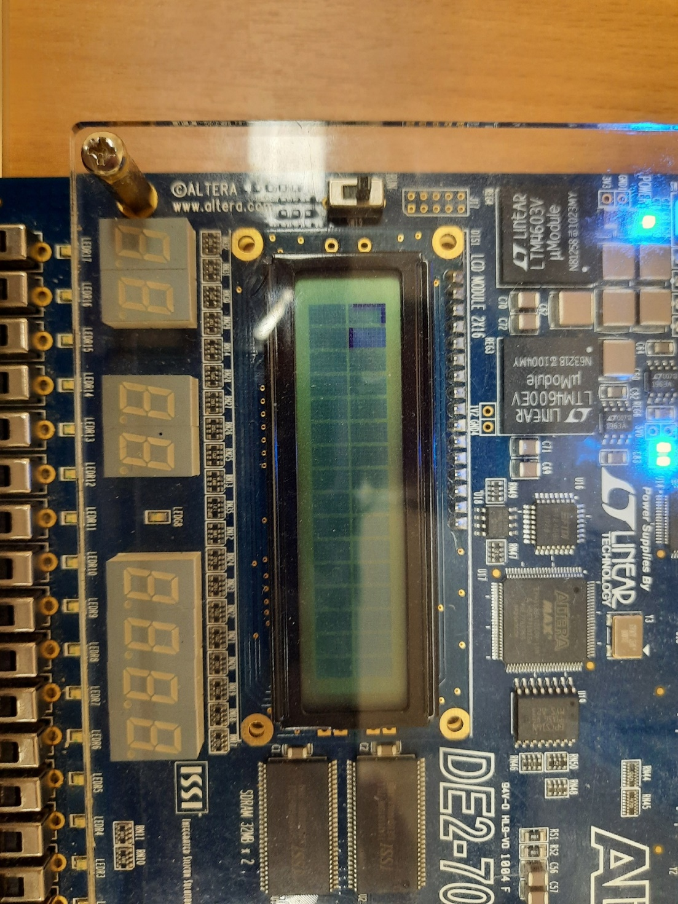
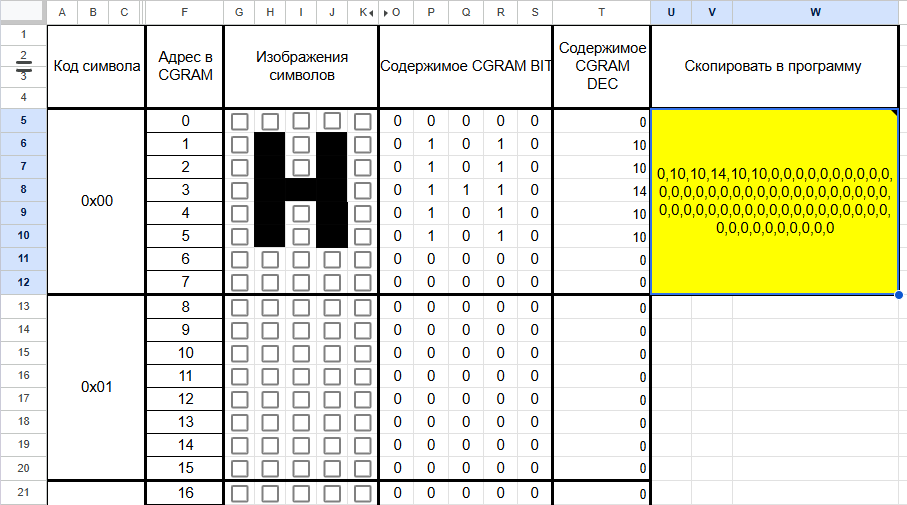
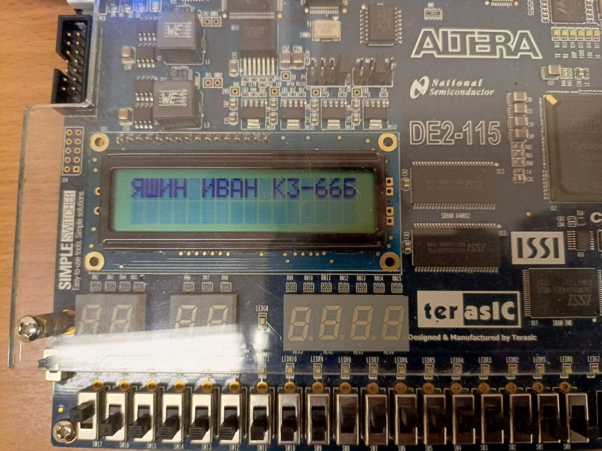
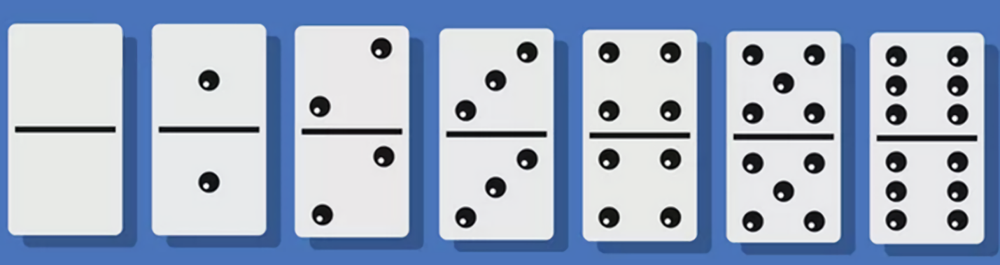
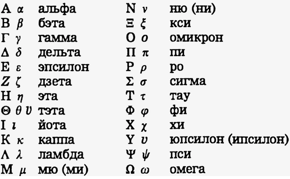
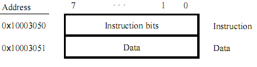
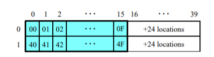
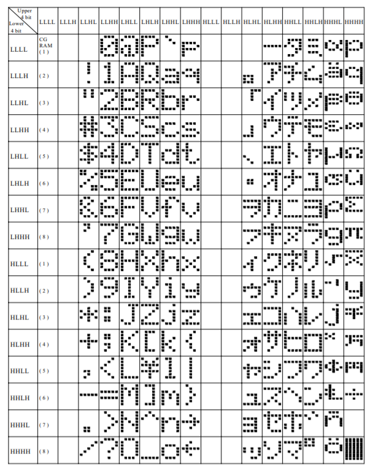
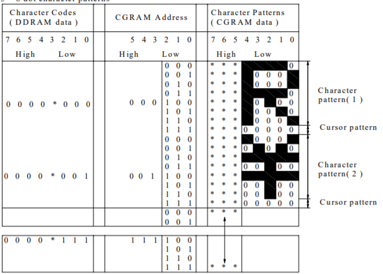
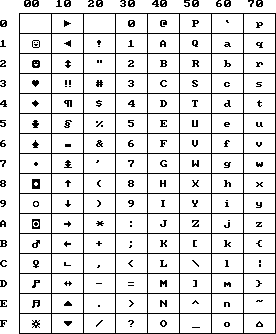

# Лабораторная работа 3. Представление символьной информации в процессорной системе и вывод её на LCD дисплей

## Цель работы

Изучить, как символьная информация представляется в памяти процессорной
системы, директивы ассемблера для работы с символьной информацией,
научиться выводить её на LCD дисплей стенда.

## Объекты изучения

- жидкокристаллический LCD дисплей, входящий в состав стенда;

- контроллер LCD дисплея;

- приложение Intel Monitor Program для работы со стендом, а точнее
  использование его для взаимодействия с периферийными устройствами.

## Планируемые результаты обучения

После выполнения этой работы студенты будут **знать:**

- Как кодируется символьная информация в вычислительных машинах;

- Какие директивы ассемблера используются для работы с символьной
  информацией;

- Как формируются изображения символов, выводимых на экран LCD дисплея;

- Как выполняется взаимодействие программных компонентов с контроллером
  LCD.

**Смогут:**

- Использовать символьную информацию в своих программах;

- Находить символьную информацию в оперативной памяти процессорной
  системы и редактировать её;

- Выводить символьную информацию на LCD дисплей стенда, как в виде
  статичного изображения, так и в виде бегущей строки;

- Создавать специализированные символы и выводить их на LCD дисплей.

- Управлять с помощью кнопок перемещением текстовых строк на экране LCD.

**Приобретут навыки:**

- использования символьной информации в своих программах;

- вывода символьной информации на индикаторы, типа LCD дисплея.

## Файлы, используемые в работе

Листинги файлов, используемых в данной работе, содержатся в приложении
Б.

Файл lcd_constants.s содержит несколько поименованных констант. Первая
из них является базовым адресом LCD дисплея, а остальные представляют
собой бинарные коды часто используемых команд, для управления дисплеем.
Содержимое этого файла, вместе с подробными комментариями представлено в
[листинге 4](#lst_4_1).

В файле lab_lcd.s содержится заготовка программы взаимодействия
процессорной системы с LCD дисплеем. Её исходный код, снабженный
подробными комментариями, приведен в [листинге 5](#Листинг5).

В файле create_g.s содержится программа, демонстрирующая создание
заглавной буквы «Г» с последующим выводом её на экран LCD. Исходный код
этой программы представлен в [листинге 6](#Листинг6). Результат
выполнения программы показан на [рисунке 3.1.](#рис31)



Рис. 3.1 Результат выполнения программы create_g.s.

[По этой
ссылке](https://docs.google.com/spreadsheets/d/1HpulPw3udaW676TLsi5YcbOordRW_qVJz9eQmPpSXKk/edit?usp=sharing)
доступен файл с google таблицей. Его можно открыть и, войдя в свой
google аккаунт, скопировать для последующего редактирования. Таблица
предназначена для создания изображений восьми специализированных
символов, которые получаются путем заливки ячеек таблицы (столбцы G:K)
черным цветом. Для этого достаточно кликнуть мышкой по соответствующей
ячейке. Повторный клик по ячейке позволит отказаться от заливки.

Фрагмент таблицы показан [на рисунке](#table_fragment) 3.2. В качестве
примера в таблице приведено изображение заглавной буквы «H», кодируемой
нулем.



Рис. 3.2 Фрагмент таблицы для формирования специализированных символов

По мере заполнения таблицы автоматически формируются байты, для записи
образов символов в память CGRAM знакогенератора, причем как в двоичном
виде, так и в десятичном. Необходимая для записи в CGRAM
последовательность байт получается в одной ячейке. Она выделена в
таблице желтым цветом. Поэтому, для выполнения [пункта
4.4](#Часть44Лаб3) задания достаточно скопировать эту ячейку и вставить
в исходный код вашей программы её содержимое.

В файле **print.s**, содержится процедура **print_russian_string**,
предназначенная для вывода текста с символами кириллицы на экран LCD. Её
исходный код, вместе с подробными комментариями, представлен в [листинге
7](#listing_7). В секции данных процедуры размещены три таблицы.

В [первой таблице](#russ_car_tab)\`russian_character_table\` содержатся
байты для создания изображений 256 символов с кодами от 0х00 до 0хFF.
Под каждый символ в ней отведено восемь байт. Однако эта таблица
заполнена только для прописных букв русского алфавита. Код ANSI первой
прописной буквы русского алфавита «А» - 0хСО. По этой причине таблица не
заполнена для 192 символов с кодами, меньшими, чем у «А» и для 32
символов с кодами, большими, чем у заглавной буквы «Я».

Если существует латинский аналог, который можно использовать для вывода
русского символа на LCD, то в соответствующих этому символу позициях
первой таблицы содержатся нулевые байты.

Во [второй таблице](#rus_tab_need) russian_character_table_needed
содержатся байты, определяющие необходимость использования изображений
символов кириллицы из первой таблицы. Как и первая, она рассчитана на
256 символов. Единичные байты в ней указывают на необходимость
использования изображений символов из первой таблицы. Нулевые - на то,
что образов соответствующих символов нет в первой таблице. Если же в
таблице содержится иное значение, то в этом случае для вывода символа на
LCD нужно использовать латинский аналог. Причем его код и будет
храниться в соответствующем байте второй таблицы.

[Третья таблица](#used_sym), used_cgram_symbols, содержит восемь байт.
Это ANSI коды тех символов, образы которых создаются и записываются в
CGRAM знакогенератора LCD самой процедурой в процессе её выполнения. В
начале работы процедуры **print_russian_string** третья таблица
полностью очищается. Если в текстовой строке встретится символ, который
не может быть выведен на LCD с использованием латинского аналога, то в
этом случае процедура запишет в память CGRAM его изображение, а в
соответствующий байт третьей таблицы ANSI код такого символа.

Когда третья таблица окажется полностью заполнена, то в этом случае для
вывода новых оригинальных символов кириллицы на LCD будут использованы
знаки вопроса.

Файл RU_string.s содержит программу, демонстрирующую вывод
русскоязычного сообщения на экран LCD. Её исходный код содержится в
[листинге 8](#листинг_бл), а результат выполнения программы показан на
[рисунке 3.3.](#рис3_8)



Рис. 3.3 Пример вывода русскоязычного текста на LCD

## Подготовка к лабораторной работе

1.  Изучите описание LCD дисплея, входящего в состав процессорной
    системы DE2-115 Media Computer
    [\[13\]](#_TocAddedNavListLiterature), его возможности. Включите в
    отчет адреса и форматы регистров управления и данных контроллера LCD
    дисплея, перечень основных команд, схему адресации позиций на экране
    дисплея и памяти в CGRAM, принцип формирования символов на экране.

2.  Подготовьте коды команд для управления LCD дисплеем и коды ASCII для
    отображения на нём вашей фамилии, имени и отчества. Потребуются для
    выполнения пунктов задания [[части
    3](#вывод-символьной-информации-на-lcd-в-режиме-бегущей-строки)](#вывод-символьной-информации-на-lcd-в-режиме-бегущей-строки).
    Включите их в отчет. Таблица кодов ASCII находится в [[приложении
    А](#ASCII)](#ASCII). ASCII коды символов текстовой строки с вашей
    фамилией, именем и отчеством также можно взять из отчета по
    предыдущей лабораторной работе 2 (пункт 3.2).

3.  Изучите директивы ассемблера .data, .ascii, .asciz, .byte, .skip,
    .include. Поместите их описания в отчет.

4.  Уясните пункты задания, выполняемого в текущей лабораторной работе.

5.  Уясните логику работы программы lab_lcd.s взаимодействия с LCD
    дисплеем. Её текст с подробными комментариями содержится в [листинге
    5](#Листинг5), в приложении Б.

6.  Уясните логику работы процедуры **print_russian_string**,
    выполняющей вывод русскоязычного текста на экран LCD. Исходный код
    этой процедуры с подробными комментариями приведен в [листинге
    7](#listing_7), в приложении Б.

7.  Выполните редактирование программы для выполнения пункта 2.7 задания
    и подготовьте новые исходные данные для тестирования программы,
    соответствующие индивидуальному варианту задания. Включите текст
    измененной программы с обновленными данными в отчет.

8.  Подготовьте изображения костяшек домино и буквы греческого алфавита
    для выполнения пункта [4.1
    задания](#создание-специализированных-символов-и-вывод-их-на-lcd).
    Выполните их кодирование в соответствии с пунктом 4.2 задания.

9.  Подготовьте программы для выполнения пунктов [4.3](#л3_4_3), 4.4,
    5.1, 5.2, 7.2.

## Вопросы для самоконтроля

1.  Что представляет собой LCD дисплей, используемый в процессорной
    системе?

2.  Каким образом выполняется вывод информации из процессорной системы
    на LCD дисплей?

3.  Как задать положение на дисплее выводимого символа?

4.  Какая кодировка используется для символов, отображаемых на LCD?

5.  Какие команды поддерживает контроллер LCD?

6.  Какое количество символов можно вывести на LCD дисплей?

7.  Что произойдет, если выполнять вывод текста за пределом первой
    (второй) строки?

8.  Какие компоненты памяти входят в состав контроллера LCD? Каково их
    назначение?

9.  Как реализовать вывод текста на LCD дисплей в режиме бегущей строки?

10. Что собой представляет знакоместо?

11. Как создать свои собственные символы для вывода их на экран LCD?

12. Как экспериментально подобрать комфортную для восприятия скорость
    движения бегущей строки?

13. Какие регистры используются в процессорной системе для
    взаимодействия с контроллером LCD? Каковы их форматы?

## Порядок выполнения лабораторной работы

### Часть 1. Исследование команд управления LCD дисплеем

Для выполнения первой части работы следует во вкладке *Memory*
приложения IMP включить опцию *Query All Devices*. Это позволит
отображать во вкладке не только содержимое ячеек памяти, но и портов
ввода/вывода. При выполнении записи в порт ввода/вывода IMP
автоматически выполняет считывание из этого порта и обновление его
содержимого в окне *Memory*, которое в случае изменения отображается
красным цветом. Нажатие кнопки *Refresh Memory* также осуществляет
считывание из порта ввода/вывода. Запись и последующее чтение регистра
данных LCD будет приводить к перемещению курсора на дисплее на две
позиции. По этой причине для выполнения следующих пунктов задания после
однократного использования опции *Query All Devices* её следует
отключить и пока не использовать кнопку *Refresh Memory*.

Вывод текста на LCD осуществляется путем записи информации в его
регистры управления и данных, а корректность его работы проверяется
путем визуального наблюдения отображаемой на LCD информации. Так как
регистры управления и данных являются восьмиразрядными, то рекомендуется
во вкладке *Memory* отображать информацию по байтам.

**1.1.** Выполните очистку дисплея, записывая соответствующую команду в
регистр управления LCD. Её номер 1 в [таблице 3.2.](#tab_3_2_1)
Обратите внимание на положение курсора, который отобразится в виде
мигающего прямоугольника. Отметьте в отчете положение курсора после
очистки экрана.

**1.2.** Отправьте в регист данных LCD ASCII код заглавной буквы вашей
фамилии. Следует напомнить, что в IMP кодировка русскоязычных
символов не поддерживается. Поэтому для выполнения этой части
задания используйте буквы латинского алфавита. Наблюдайте выводимый
символ на экране. Обратите внимание на изменение положения курсора
после вывода первой буквы.

**1.3.** Исследуйте возможности команды настройки отображения экрана. Её
номер [8 в таблице 3.2](#com_8). Попробуйте отключить курсор в виде
мигающего прямоугольника, используя бит В в команде. Убедитесь, что
курсор исчез с экрана.

**1.4.** Вновь включите изображение курсора, но теперь уже в виде знака
подчеркивания, используя бит С в команде. Наблюдайте его вид на
экране LCD. После этого выведите на LCD вторую, теперь уже строчную
букву вашей фамилии.

**1.5.** Временно выключите отображение текста на экране LCD, используя бит D
в команде настройки отображения экрана, а потом вновь включите.

**1.6.** Продолжите вывод вашей фамилии на первой строке дисплея, отправляя
коды символов в регистр данных LCD. Обратите внимание на то, что
текущее содержимое регистров команд и данных LCD, отображаемое во
вкладке *Memory,* не меняется. Как вы думаете, почему? Отразите в
отчете ваше заключение.

**1.7.** Установите курсор в начало второй строки дисплея, используя
последнюю команду из [таблицы 3.2.](#com_11) Её номер 11. Выведите
на второй строке ваше имя, начиная с заглавной буквы. Сделайте
снимок экрана LCD с выведенным текстом и поместите его в отчетные
материалы.

**1.8.** Чтобы осмыслить текущее содержимое регистров команд и данных LCD
порта выполните их чтение во вкладке *Memory*, используя кнопку
*Refresh Memory.* Для этого еще раз включите опцию *Query All
Devices.* Затем установите курсор в начало первой строки, отправив в
регистр команд LCD соответствующую команду. После записи команды в
регистр команд автоматически будет выполняться его чтение.
Наблюдайте текущее содержимое регистров команд и данных порта и
следите за положением курсора на LCD. Поместите в отчет наблюдаемые
значения и ваши объяснения. Используя кнопку *Refresh Memory* еще
раз прочитайте содержимое обоих регистров LCD. Попробуйте объяснить
их значения, наблюдая за текущим положением курсора и отображаемым в
этой позиции LCD символом. Для выполнения остальных пунктов задания
отключите опцию *Query All Devices.*

**1.9.** Экспериментально определите возможности команды настройки режима
вывода текста на экран LCD. Её номер 3 в [таблице 3.2](#com_3). Для
этого изменяйте значения битов I/D и S в этой команде. Рассмотрите
четыре возможных варианта её выполнения. После отправки команды
отправляйте код символа в регистр данных LCD. Фиксируйте ваши
наблюдения прямо в [таблице 3.2](#tab_3_2_1), которую следует
добавить в отчетные материалы.

**1.10.** Перед выполнением этого пункта задания верните LCD в режим работы по
умолчанию, отправив в его регистр команд значение 0х06.
Экспериментально исследуйте возможности команды сдвига курсора или
текста на экране LCD. Её номер 9 в [таблице 3.2.](#com_9) Для этого
изменяйте значения битов S/C и R/L в этой команде. Фиксируйте ваши
наблюдения в отчете. Добавьте в [таблицу 3.2](#tab_3_2_1), сразу
после исследуемой команды четыре возможных варианта её выполнения.

**1.11.** Поместите курсор в конец первой строки (в невидимую часть) и
отправьте последовательность символов «1», «2», «3» в регистр данных
LCD. Наблюдайте результат на дисплее. Добавьте в отчет ваши
комментарии.

**1.12.** Поместите курсор в конец второй строки (в невидимую часть) и
отправьте последовательность символов «4», «5», «6» в регистр данных
LCD. Наблюдайте результат на дисплее. Добавьте в отчет ваши
комментарии.

**1.13.** Выполните сдвиг отображаемых строк на одну позицию вправо.
Наблюдайте результат на LCD. Отразите в отчете ваши соображения по
поводу поведения курсора и работы LCD дисплея.

### Часть 2. Программное управление LCD дисплеем

**2.1.** Скомпилируйте программу lab_lcd.s и загрузите в память процессорной
системы. Начните выполнять программу по шагам, осмысливая
производимые ею действия. В цикле вывода текстовой строки на экран
LCD в программе рекомендуется поставить контрольную точку и
выполнять программу в автоматическом режиме, наблюдая вывод текста
по одному символу.

**2.2.** После уяснения логики вывода первой текстовой строки на экран LCD
поставьте контрольную точку на команде, выполняемой сразу после
завершения цикла, а предыдущую контрольную точку удалите. Продолжите
выполнение программы по шагам до цикла вывода второй текстовой
строки, осмысливая выполняемые программой действия. Отразите в
отчете наблюдаемый результат.

**2.3.** Поставьте контрольную точку в цикле вывода второй текстовой строки.
Наблюдайте вывод второй строки по одному символу, продолжая
выполнение программы в автоматическом режиме.

**2.4.** Затем поставьте контрольную точку на команде с локальной меткой 1,
выполняемой сразу после выхода из этого цикла, а предыдущую
контрольную точку удалите. Обратите внимание на то, как в команде
условного перехода указан переход вперед на локальную метку.
Продолжите выполнение программы в автоматическом режиме. Отразите в
отчете наблюдаемый результат.

**2.5.** Выполняйте следующие команды по шагам, наблюдая результат. Обратите
внимание на то, как указывается целевой адрес в команде безусловного
перехода. Используемый в ней символ точки задает адрес текущей
команды. Поместите в отчет ваши комментарии, относительно поведения
программы.

**2.6.** Запишите в счетчик команд (регистр РС в окне регистров) адрес
команды, помеченной локальной меткой 2. Следует напомнить, что для
этого достаточно дважды кликнуть по соответствующей строке программы
во вкладке *Disassembly*. Текущая команда выделится желтым цветом.
Поставьте контрольную точку по адресу следующей команды. Продолжите
выполнение программы еще несколько раз. Наблюдайте результат и
отобразите его в отчете.

**2.7.** После полного уяснения логики работы программы выполните её
редактирование, предварительно сохранив её с новым именем, таким
образом, чтобы программа выводила на первой строке LCD дисплея вашу
фамилию, имя и отчество и номер группы, а на второй строке в начале
слово «nachalo», в конце строки (в невидимой части) слово «konec», а
в середине – все цифры заданной в соответствии с вариантом системы
счисления, причем в том порядке, который задан вашим вариантом в
[таблице 3.4.](#табл3_3_4)

### Часть 3. Вывод символьной информации на LCD в режиме бегущей строки

**3.1.** Модифицируйте программу из предыдущего пункта таким образом, чтобы
информация на экране LCD выводилась в режиме бегущей строки.
Используйте программную задержку. Экспериментально подберите её так,
чтобы выводимая на экран информация была легко читаема. Покажите
результат работы программы преподавателю. Поместите в отчет листинг
отлаженной программы и фото, выводимой на экран LCD информации.

### Часть 4. Создание специализированных символов и вывод их на LCD

**4.1.** С помощью google таблицы, создайте изображение восьми
специализированных символов в формате 8 на 5 клеток. В качестве семи
символов используйте изображения половинок костяшек для игры в
домино (от пусто до шестёрки). Вид костяшек дублей приведен на
[рисунке 3.4](#рис34). В качестве восьмого символа используйте одну
из строчных букв греческого алфавита, номер которой в алфавите
совпадает с порядковым номером студента в списке группы. Сам алфавит
представлен ниже на [рисунке 3.5](#рис35).



Рис. 3.4 Внешний вид костяшек для игры в домино



Рис. 3.5 Буквы греческого алфавита

**4.2.** Выполните кодирование половинок костяшек и буквы греческого алфавита
кодами от 0 до 7. Причем изображению костяшки «пусто» поставьте в
соответствие код, полученный путем пересчета по модулю 8 порядкового
номера студента в списке группы. Остальным символам назначьте
следующие значения кодов. Для выполнения этого и предыдущего пунктов
задания используйте шаблон из google таблицы. Например, для
порядкового номера 17, код половинки костяшки «пусто» будет 1, код
половинки костяшки «один» будет два, и так далее. Код половинки
костяшки «шесть» будет 7, а код буквы омикрон будет ноль.

**4.3.** Поместите в отчет таблицу с кодировкой
специализированных символов, полученную после заполнения шаблона.

**4.4.** Напишите программу на ассемблере, которая заполнит оперативную
память CGRAM знакогенератора LCD с учетом выполнения предыдущих двух
пунктов задания и
выведет все созданные символы слева направо на первой строке экрана
LCD для нечетных вариантов, либо на второй строке экрана для четных
вариантов. Причем начальное смещение в строке экрана должно
совпадать с кодом символа «пусто», вычисленным в пункте 4.2.

### Часть 5. Вывод специализированных символов на экран LCD в заданной последовательности. Просмотр символьных строк с использованием кнопок

**5.1.** Напишите программу,
которая выводит некоторую последовательность костяшек на экран LCD,
начиная с первой позиции экрана следующим образом. Каждая костяшка
выводится в двух позициях. На первой строке – её верхняя половинка,
на второй строке – нижняя половинка. Первой идет заданная костяшка.
Следующие костяшки последовательности подбираются студентами
самостоятельно так, чтобы каждая последующая костяшка продолжала
начатый ряд по правилу домино. Например, для первой костяшки 1/2
следующей может быть 2/4, причем вторая костяшка должна быть
перевернута, чтобы продолжить начатый ряд. Следующей может быть 4/1
и так далее по правилу домино. Студентам надо подобрать такую
последовательность, чтобы разложить все 28 костяшек домино, включая
костяшки дубли. После выполнения программы на экране LCD мы будем
видеть первые 16 костяшек последовательности. Первая костяшка
последовательности определяется по двум цифрам порядкового номера
студента в списке группы. Цифры большие шести пересчитываются по
модулю шесть.

**5.2\*.** Внесите изменения в
программу из предыдущего пункта таким образом, чтобы при нажатии кнопки
KEY1 выводимые на экран строки перемещались на одну позицию вправо, а
при нажатии кнопки KEY3 на одну позицию влево. Продемонстрируйте работу
программы преподавателю. Сделайте несколько снимков экрана LCD и
поместите их в отчетные материалы так, чтобы вся последовательность
костяшек на них была видна. Потребуется не менее двух снимков.

### Часть 6. Экспериментальное определение кодов букв русского алфавита

**6.1.** Используя директиву .asciz, определите коды букв русского алфавита,
формируемые после компиляции программы в IMP, причем как прописных,
так и строчных. Для этого разместите в отдельной секции данных две
текстовые строки как с прописными, так и строчными буквами русского
алфавита. Секцию данных разместите в ОП отдельно от кода программы в
начале статической памяти SRAM. После компиляции и загрузки
программы в ОП найдите в памяти две текстовые строки с кодами букв
русского алфавита. Используя вкладку *Memory* и побайтовое
отображение ОП наблюдайте коды отдельных букв кириллицы. Поместите
коды букв, входящих в вашу фамилию в заранее подготовленную [таблицу
3.5](#tab_3_5_1) в приложении В. Рассмотрите варианты использования
в текстовом редакторе, в котором создается или редактируется файл с
буквами русского алфавита кодировок UTF-8 и ANSI.

### Часть 7. Вывод русскоязычных сообщений на экран LCD

**7.1.** Уясните логику работы процедуры **print_russian_string**. Её
[листинг 7](#listing_7), вместе с подробными комментариями приведен
в приложении Б. Выведите на экран LCD ваши фамилию, имя и отчество с
использованием прописных (заглавных) букв русского алфавита.
Сделайте снимок экрана и поместите его в отчет. Следует напомнить,
что в процедуре **print_russian_string** используется однобайтовая
кодировка русских символов ANSI. Поэтому в случае некорректной
работы программы нужно её исходный код сохранить именно в этой
кодировке.

**7.2\*.** Внесите изменения в
процедуру **print_russian_string** таким образом, чтобы она смогла
вывести вашу фамилию на экран LCD с использованием также и строчных букв
русского алфавита. Изменения касаются только тех букв, которые
содержатся в вашей фамилии. Продемонстрируйте работу программы
преподавателю. Сделайте снимок экрана и поместите его в отчетные
материалы, вместе с фрагментом измененной программы.

## Отчетные материалы

Отчетные материалы должны содержать.

1.  Цель лабораторной работы.

2.  Материалы, связанные с подготовкой к работе, включая теоретическую
    часть и исходные коды программных заготовок с именами **lab_lcd.s**.
    и **print_russian_string.**

3.  Информацию по выполнению каждого пункта задания. Причем в отчете
    должны содержаться выполняемые вами действия, наблюдаемые
    результаты, и ваши объяснения. Наблюдаемые результаты должны быть
    подтверждены снимками экрана инструментального компьютера или
    снимками стенда.

4.  Подготовленные и отлаженные вами фрагменты программ, для выполнения
    пунктов 2.7, 3.1, [4.3](#п3_4_3), [4.4](#п3_4_4),
    [5.1](#Часть51Лаб3), [5.2](#п3_5_2), [7.2](#п3_7_2) задания.

5.  Краткое заключение.

## Защита лабораторной работы

Для защиты работы студенты должны продемонстрировать знания, умения и
навыки, перечисленные в разделе «Планируемые результаты обучения».
Выражаясь конкретнее, студенты должны уметь:

1.  Использовать символьную информацию в своих программах, включая буквы
    русского алфавита;

2.  Находить символьную информацию в ОП процессорной системы;

3.  Выводить символьную информацию на LCD дисплей, как в виде
    статического изображения, так и в виде бегущей строки;

4.  Создавать специальные символы и выводить их на экран LCD.

    **Примерные задания, предлагаемые студентам для защиты работы**

<!-- -->

1.  Напишите программу, которая периодически меняет местами выводимые на
    LCD символьные строки.

2.  В отличии от предыдущего задания программа меняет местами выводимые
    строки только после нажатия некоторой кнопки на стенде.

3.  Напишите программу, которая в зависимости от состояния указанного
    переключателя выводит на экран LCD некоторое сообщение, либо в
    начале экрана, либо в конце видимой его части.

4.  Напишите программу, которая периодически перемещает выводимый текст
    сначала в конец видимой части дисплея, затем возвращает его обратно.

5.  В отличии от предыдущего задания программа перемещает текст на
    дисплее только после нажатия некоторой кнопки на стенде.

6.  Напишите программу, которая периодически перемещает слово с начала
    первой строки в конец первой строки, затем в конец второй строки,
    затем в начало второй строки, затем в начало первой строки и так
    далее, создавая эффект кругового перемещения слова на экране по
    часовой стрелке.

7.  В отличии от предыдущего задания программа перемещает текст на
    экране только после нажатия некоторой кнопки на стенде.

8.  Напишите программу, которая выводит на первой строке LCD все символы
    заданного столбца таблицы ASCII, а на второй строке все символы из
    следующего столбца таблицы.

9.  В отличии от предыдущего задания номер столбца задается некоторыми
    переключателями.

10. Напишите программу, которая выводит на экран LCD 32 символа, коды
    которых последовательно увеличиваются, начиная с кода, задаваемого
    некоторыми переключателями.

11. Напишите программу, которая выводит на первой строке LCD все символы
    из заданной строки расширенной таблицы ASCII (256 кодов), а на
    второй строке все символы из следующей строки таблицы.

12. Напишите программу, которая выводит на первой строке LCD строку
    таблицы ASCII, номер которой задается некоторыми переключателями, а
    на второй строке - столбец таблицы с этим же номером.

13. В отличии от предыдущего задания номера строки и столбца задаются
    разными переключателями.

14. Напишите программу, в которой выполняется перемещение строк на
    экране LCD вправо на одну позицию, при нажатии кнопки key1, и на
    одну позицию влево при нажатии кнопки key3.

15. Создайте изображение заданной преподавателем буквы греческого
    алфавита и внесите его в память знакогенератора LCD, используя для
    кодирования этого символа заданный код (от 0 до 7). Внесите
    изменения в программу вывода ваших ФИО в режиме бегущей строки, так,
    чтобы заданная буква греческого алфавита размещалась в выводимой
    строке между фамилией и именем.

## Приложения

### Приложение А. Краткое описание LCD дисплея и его контроллера

Процессорная система «DE2-115(70) Media Computer» включает порт для
взаимодействия с жидкокристаллическим дисплеем LCD стенда. Программно
доступными регистрами порта являются регистр команд, используемый для
управления дисплеем LCD и регистр данных, используемый для отправки
символьных данных для отображения их на дисплее. Форматы этих регистров,
вместе с адресами показаны на рисунке 3.6.



Рис. 3.6 Программно доступные регистры LCD порта

Регисты LCD порта также доступны и по чтению. Если прочитать из регистра
команд, то можно узнать значение счетчика адреса памяти DDRAM, и,
следовательно, текущее положение курсора на экране. Если прочитать
содержимое регистра данных, то можно узнать код символа, размещенный в
этой позиции.

В состав LCD дисплея входит встроенный блок управления, который
обрабатывает поступающие в LCD порт команды и три компоненты памяти
**DDRAM**, **CGROM**, **CGRAM**.

**DDRAM** (Display Data RAM) — это оперативная память для записи
выводимого на экран дисплея текстового сообщения. Каждой позиции на
экране соответствует один байт в этой памяти. Другими словами, в памяти
DDRAM размещается буфер выводимых на экран символов. Все символы,
записываемые в этот буфер, выводятся на экран LCD в соответствующую
позицию.

Позиции на экране адресуются с использованием двух координат (y, x), как
показано на рисунке 3.7. Верхней строке соответствует координата y,
равная нулю, а нижней строке координата у, равная единице. Координата х
меняется в диапазоне от 0 до 39 (0х27), что соответствует 40 символам,
которые можно записать в символьный буфер DDRAM для каждой строки
экрана. Однако видимыми на экране LCD являются только 16 символов.
Cодержимое невидимой части символьного буфера можно вывести на экран
только в режиме бегущей строки, перемещая текст по экрану. Для этого
предусмотрены специальные команды, о которых речь пойдет ниже.


Рис. 3.7 Схема адресации позиций на экране символьного дисплея

Таким образом, для адресации 80 позиций на экране и, следовательно,
байтов в символьном буфере, то есть в памяти DDRAM, используется
семиразрядный счетчик адреса. Выделяемая курсором на экране LCD позиция,
соответствует текущему значению счетчика адреса DDRAM. Если записать по
этому адресу ASCII код символа, то сам символ будет отображен в
выделенной позиции экрана.

В соответствии с [рис. 3.7](#рис37), диапазон адресов в DDRAM для
верхней и нижней строк дисплея начинается с адресов 0х00 и 0х40, как
показано на рис 3.8. Голубым цветом показаны позиции, видимые на экране.



Рис. 3.8 Адреса позиций видимой и невидимой части LCD дисплея

Следующей компонентой памяти является постоянная память CGROM (Character
Generator ROM). Эта память доступна только для чтения, и её изменить
нельзя. В памяти CGROM хранится таблица с изображениями символов
([таблица 3.1](#tab_3_1_1)), то есть это память знакогенератора. Когда в
какую- нибудь ячейку DDRAM записывается байт с кодом символа, то из этой
таблицы берется изображение соответствующего символа и прорисовывается
на экране LCD.

*Таблица 3.1.*

**Таблица с изображениями встроенного в LCD шрифта**



Третьей компонентой памяти является память оперативная **CGRAM**
(Character Generator RAM). В ней тоже хранятся изображения нескольких
символов, а точнее первых восьми символов первого столбца, показанного в
таблице 3.1 пустым. В отличии от памяти постоянной, содержимое CGRAM
можно изменять, создавая таким образом свои собственные символы. Для
представления одного символа или знака используется матрица 5 на 8
пикселей. Поэтому в памяти CGRAM для представления каждого символа
потребуется 8 байт, причем старшие три бита каждого байта не
используются.

Адресуется память CGRAM следующим образом. Первые восемь байт, начиная с
нулевого адреса, задают изображение символа c кодом 0х00 построчно,
сверху вниз. Причем, установленный бит соответствует одной выделенной
точке на экране дисплея. Затем второй символ с кодом 0х01 таким же
образом, задается с помощью 8 байт, начиная с адреса 8. В последний байт
с изображением символа рекомендуется записывать нули, чтобы использовать
это место для корректного отображения на экране LCD курсора в виде
нижнего подчеркивания.

В CGRAM может быть размещено изображение только 8 специализированных
символов, причем этим символам соответствуют коды с 0х00 до 0х07. По
этой причине размер CGRAM равен 64 байтам. Если в первые 8 байт CGRAM
записать какой - либо символ, а потом записать в DDRAM нуль (код первого
символа в CGRAM), то на экране прорисуется этот новый символ. Таким
образом записывая в DDRAM код символа, указанный в левом столбце рисунка
3., можно отобразить и сам символ, изображение которого хранится в
CGRAM.



Рис. 3.9 Принцип адресации CGRAM памяти и формирования изображения
символов на экране LCD.

Ниже [в таблице 3.2](#tab_3_2_1) приведены команды для управления LCD
дисплеем. В ней используются следующие обозначения.

**I/D** — инкремент или декремент счетчика адреса. По умолчанию, этот
бит равен нулю и выполняется инкремент счетчика. То есть каждый
следующий байт будет записываться в следущую, i+1 ячейку DDRAM. Если
установить этот бит в единицу, то будет выполняться декремент счетчика.

**S** — бит сдвига экрана. Если его установить в единицу, то с каждым
новым символом будет сдвигаться окно экрана, пока не достигнет конца
DDRAM. Удобно использовать, когда выводится на экран большая строка,
чтобы она не убежала за экран.

**D** — бит включения дисплея. Если очистить этот бит, то изображение
исчезнет с экрана, а чтобы оно вновь появилось, в эту позицию надо
записать 1.

**С** — бит включения курсора в виде нижнего подчеркивания. Если
установить этот бит в единицу, то появится курсор в виде нижнего
подчеркивания.

**B** — бит включения курсора в виде мигающего черного прямоугольника.

**S/C** — сдвиг курсора или экрана. Если ноль, то сдвигается курсор.
Если единица, то текст на экране. По одному разу за команду.

**R/L** — определяет направление сдвига. 0 — влево, 1 — вправо.

**AG** — адрес в памяти знакогенератора CGRAM.

**АD** — адрес в памяти символьного буфера DDRAM.

*Таблица 3.2.*

**Команды управления LCD**

| № п\п | DB7 | DB6 | DB5 | DB4 | DB3 | DB2 | DB1 | DB0 | Значение |
| --- | --- | --- | --- | --- | --- | --- | --- | --- | --- |
| 1 | **0** | **0** | **0** | **0** | **0** | **0** | **0** | **1** | Очистка экрана. Счетчик адреса устанавливается в 0 позицию DDRAM. |
| 2 | **0** | **0** | **0** | **0** | **0** | **0** | **1** | **—** | Адресация в DDRAM. Отмена сдвигов, Счетчик адреса устанавливается в 0. |
| 3 | **0** | **0** | **0** | **0** | **0** | **1** | **I/D** | **S** | Настройка режима вывода текста на экран. |
| 4 | **0** | **0** | **0** | **0** | **0** | **1** | **0** | **0** | Поле для самостоятельного заполнения |
| 5 | **0** | **0** | **0** | **0** | **0** | **1** | **0** | **1** | Поле для самостоятельного заполнения |
| 6 | **0** | **0** | **0** | **0** | **0** | **1** | **1** | **0** | Поле для самостоятельного заполнения |
| 7 | **0** | **0** | **0** | **0** | **0** | **1** | **1** | **1** | Поле для самостоятельного заполнения |
| 8 | **0** | **0** | **0** | **0** | **1** | **D** | **C** | **B** | Настройка режима отображения |
| 9 | **0** | **0** | **0** | **1** | **S/C** | **R/L** | **—** | **—** | Сдвиг курсора или текста, в зависимости от установленных битов. |
| 10 | **0** | **1** | **AG** | **AG** | **AG** | **AG** | **AG** | **AG** | Переключить адресацию на CGRAM и задать адрес в CGRAM. |
| 11 | **1** | **AD** | **AD** | **AD** | **AD** | **AD** | **AD** | **AD** | Переключить адресацию на DDRAM и задать адрес в DDRAM. |

*Таблица 3.3.* 

Коды символов ASCII, первая половина таблицы



### Приложение Б. Файлы, используемые в лабораторной работе

**Листинг 4. Содержимое файла `lcd_constants.s`**

```asm
.equ lcd,   0x10003050   /*Адрес регистра lcd*/

.equ clear, 0b00000001   /*Код команды очистки экрана lcd*/

.equ set1,  0b10000000   /*Код команды установки курсора в начало
первой строки*/

.equ set2,  0b11000000   /*Код команды установки курсора в начало
второй строки*/

.equ off,   0b00001100   /*Код команды выключения курсора*/

.equ right, 0b00011100   /*Код команды сдвига текста вправо*/

.equ left,  0b00011000   /*Код команды сдвига текста влево*/
```

**Листинг 5. Текст программной заготовки `lab_lcd.s`**

```asm
.include "lcd_constants.s" /*
Добавляем константы из файла */

.global _start

.text /*Определяем секцию кода*/

_start:

movia r2,lcd /* Адрес LCD в регистр r2 */

movi r3,clear   /*Команду очистки lcd в r3*/

stbio r3,0(r2) /*Очищаем экран lcd*/

movi r3,set1

stbio r3,0(r2)   /*Устанавливаем курсор в начало первой строки на
LCD*/

movia r4,String1 /*В регистр r4 записываем адрес первой строки в
ОП*/

cikl:

    ldb r5,0(r4)   /*Считываем символ из строки (ОП) и помещаем его
в r5*/

    beq r5,zero,met /*Если считанный символ равен 0, выходим из
цикла*/

    stbio r5,1(r2)   /*Пересылаем из r5 в регистр данных lcd*/

    addi r4,r4,1     /*Инкрементируем адрес символа в строке*/

    br cikl /* Повторяем для остальных символов */

met:

    movi r3,set2

    stbio r3,0(r2)   /*Устанавливаем курсор в начало второй строки
на LCD*/

movia r4,String2     /*Выводим вторую строку на LCD*/

cikl2:

    ldb r5,0(r4)

    beq r5,zero,1f

    stbio r5,1(r2)

    addi r4,r4,1

    br cikl2

1:

    movi r3,off

    stbio r3,0(r2)   /*Выключаем курсор*/

    movi r3,right

    stbio r3,0(r2)   /*Сдвигаем строки вправо */

    br .-4 /* Повторяем сдвиг строк */

 2:

movi r3,left

    stbio r3,0(r2)   /*Сдвигаем строки влево */

    br 2b+4 /* Повторяем сдвиг строк */

.data       /*Определяем секцию данных*/

String1:

.asciz "Familiya                           konec"

String2:

.asciz "Imya"

.end
```

**Листинг 6. Текст программы `create_g.s`**

```asm
.include "lcd_constants.s "
/* Добавляем константы из файла */

.global _start

..text

_start:

movia r2, lcd /*Адрес lcd в r2*/

movia r9, 0b01010000 /*Готовим команду для адресации CGRAM, код
символа 2*/

stbio r9, 0(r2) /*Отправка команды в регистр команд LCD */

movia r9, 0b00011111 /*Первый байт для символа Г */

stbio r9, 1(r2) /*Отправка байта в регистр данных*/

movia r9, 0b00010000 /*Второй байт для символа Г */

stbio r9, 1(r2) /*Отправка байта в регистр данных*/

stbio r9, 1(r2) /*Отправка третьего байта для символа Г */

stbio r9, 1(r2) /*Отправка четвертого байта для символа Г */

stbio r9, 1(r2) /*Отправка пятого байта для символа Г */

stbio r9, 1(r2) /*Отправка шестого байта для символа Г */

stbio r9, 1(r2) /*Отправка седьмого байта для символа Г */

stbio zero, 1(r2) /*Отправка восьмого байта для символа Г */

movia r9, set1 /*Курсор в начало первой строки */

stbio r9, 0(r2) /*Отправка команды в регистр команд*/

movia r9, 0b00000010 /*Код 2=0b10, используется для кодирования «Г»
*/

stbio r9, 1(r2) /*Отправка кода символа в регистр данных*/

.end
```

**Листинг 7. Исходный код программы `print_russian_string`**

```asm
.include
"lcd_constants.s" /* Добавляем файл с константами */

.text

/* Процедура вывода на LCD русскоязычного текста */

.global print_russian_string /* имя процедуры */

print_russian_string:

/* Принимает: */

/* r12 - адрес выводимой строки */

/* Использует: */

/* r12 - адрес выводимого символа */

/* r14 - символ ANSI */

subi
 sp, sp, 12 /* Резервируем место в стеке */

stw
 ra, 0(sp) /* Сохраняем в стеке регистры */

stw
 r12, 4(sp)

stw
 r14, 8(sp)

1:

ldbu
 r14, (r12) /* Читаем символ из строки */

beq
 r14, r0, 1f /* Если он последний, то завершаем
процедуру */

call
 print_russian_character /* Вызываем процедуру
вывода символа на LCD */

addi
 r12, r12, 1 /* Адресуем следующий символ */

br
 1b /* Повторяем */

1:

ldw
 ra, 0(sp) /* Восстанавливаем регистры из стека
*/

ldw
 r12, 4(sp)

ldw
 r14, 8(sp)

addi
 sp, sp, 12 /* Корректируем указатель стека
*/

ret

/*/

/* Процедура вывода на LCD символа кириллицы */

.global print_russian_character

print_russian_character:

/* Принимает: */

/* r14 - символ ANSI */

/* Использует: */

/* r2 - адрес LCD */

/* r11 - команда/данные для LCD */

/* r13 - символ CGRAM */

/* r15 - смещение внутри таблицы символов */

/* r16 - базовый адрес таблицы соответствий, базовый адрес таблицы
символов */

/* r17 - промежуточные значения */

/* r18 - единица */

/* r19 - положение курсора перед выводом символа */

/* Сохраняем используемые регистры в стеке */

subi
 sp, sp, 36

stw
 ra, 0(sp)

stw
 r2, 4(sp)

stw
 r11, 8(sp)

stw
 r13, 12(sp)

stw
 r15, 16(sp)

stw
 r16, 20(sp)

stw
 r17, 24(sp)

stw
 r18, 28(sp)

stw
 r19, 32(sp)

/* Записываем адрес регистра инструкций LCD*/

movia
 r2, lcd

/* Проверяем, надо ли выводить символ в соответствии с таблицей 2
*/

movi
 r18, 1

movia
 r16, russian_character_table_needed /*адресуем
таблицу 2*/

add
 r16, r16, r14 /*смещение символа в таблице
*/

ldb
 r17, (r16) /* загружаем байт из таблицы */

beq
 r17, r0, 1f /* если он равен 0, то кодировку
символа не меняем */

bne
 r17, r18, 2f /* если не равен 1, выводим
латинский аналог */

br
 3f /* если другое, то ищем символ в CGRAM */

1:

/* Выводим символ в таком коде, в каком он есть. Это для символов из
CGROM*/

stbio
 r14, 1(r2)

br
 5f

2:

/* Выводим латинский аналог символа, в соответствии с таблицей
2*/

stbio
 r17, 1(r2)

br
 5f

6:

/* Выводим символ кириллицы, если он уже был создан и сохранен в
CGRAM */

stbio
 r13, 1(r2)

br
 5f

3:

/* Ищем символ в таблице CGRAM */

call
 search_used_cgram_symbol

/* Если символ использован, то в r13 его код (0-7) в CGRAM, а r17=1
*/

bne
 r17, r0, 6b /* Выводим символ из CGRAM */

/* Проверяем, что заняты не все свободные символы */

subi
 r17, r13, 8

bne
 r17, r0, 4f

movi
 r17, '?' /* Выводим "?" на LCD, если вся память
CGRAM занята*/

stbio
 r17, 1(r2) /* Это значит, что возможности
вывести символ нет*/

br
 5f

4:

/* Резервируем этот код CGRAM символа */

movia
 r16, used_cgram_symbols /* адресуем таблицу 3
*/

add
 r16, r16, r13 /* смещение в таблице 3*/

stb
 r14, (r16) /* записываем ANSI код символа в
таблицу 3 */

/* Выводим символ в соответствии с таблицей 1 русских символов */

movia
 r16, russian_character_table /* адресуем
таблицу */

slli
 r15, r14, 3 /* вычисляем смещение в таблице
*/

add
 r16, r16, r15 /* в r16 адрес первого байта
образа символа */

/* Сохраняем положение курсора на данный момент времени */

ldbio
 r19, (r2)

/* Переводим LCD в режим записи в CGRAM (будем использовать символ с
кодом указанным в r13) */

slli
 r17, r13, 3 /*готовим адрес в CGRAM */

movi
 r11, 0b01000000 /*готовим команду для записи в
CGRAM */

or
 r11, r11, r17 /* команда в r11 */

stbio
 r11, (r2) /* записываем её в регистр команд
*/

movi
 r17, 8 /* количество байт для записи символа в
CGRAM */

1:

/* В цикле записываем 8 байт образа символа в CGRAM */

ldb
 r11, (r16) /* читаем байт из таблицы 1
russian_character_table */

stbio
 r11, 1(r2) /*записываем его в CGRAM */

addi
 r16, r16, 1 /* адресуем следующий байт в
таблице */

addi
 r17, r17, -1 /* декремент r17 */

bne
 r17, r0, 1b /* если не все байты записали,
повторяем */

/* Восстанавливаем положение курсора в DDRAM */

movi
 r11, 0b10000000

or
 r11, r11, r19

stbio
 r11, (r2)

/* Выводим символ, используя код, который под него заняли */

stbio
 r13, 1(r2) /* отправляем его в регистр данных
LCD */

5:

/* Восстанавливаем регистры из стека */

ldw
 ra, 0(sp)

ldw
 r2, 4(sp)

ldw
 r11, 8(sp)

ldw
 r13, 12(sp)

ldw
 r15, 16(sp)

ldw
 r16, 20(sp)

ldw
 r17, 24(sp)

ldw
 r18, 28(sp)

ldw
 r19, 32(sp)

addi
 sp, sp, 36 /* освобождаем свободное место в
стеке*/

ret

/*/

/* Процедура очистки таблицы с кодами используемых символов кириллицы
*/

reset_used_cgram_symbols_table:

/* Использует: */

/* r2 - адрес `used_cgram_symbols` */

/* Сохраняем r2 в стеке */

subi
 sp, sp, 4

stw
 r2, (sp)

/* Записываем восемь нулевых байт в таблицу использованных символов
*/

movia
 r2, used_cgram_symbols /* адрес таблицы в r2
*/

stw
 r0, (r2)

stw
 r0, 4(r2)

/* Восстанавливаем r2 из стека */

ldw
 r2, (sp)

addi
 sp, sp, 4

ret

/*/

/* Процедура поиска символа кириллицы в таблице с используемыми
символами*/

search_used_cgram_symbol:

/* Получает: */

/* r14 - символ ANSI */

/* Использует: */

/* r2 - адрес таблицы `used_cgram_symbols` */

/* r12 - количество итераций поиска */

/* r15 - данные из таблицы `used_cgram_symbols` */

/* Возвращает: */

/* r13 - номер символа CGRAM (если нет свободных, возвращает 0x08)
*/

/* r17 - использован ли этот символ ранее */

subi
 sp, sp, 12 /*резервируем место в стеке */

stw
 r2, (sp) /* сохраняем регистры в стеке */

stw
 r12, 4(sp)

stw
 r15, 8(sp)

movia
 r2, used_cgram_symbols /* адресуем таблицу
3*/

movi
 r12, 8 /*количество байт в таблице*/

movi
 r13, 0 /* если таблица пуста, то свободный код
0*/

movi
 r17, 0 /* Очищаем флаг " символ не использован"
*/

1:

/* Проверяем на конец цикла */

beq
 r13, r12, 1f

/* Загружаем данные из `used_cgram_symbols` */

ldbu
 r15, (r2)

/* Проверяем, не занят ли символ CGRAM */

beq
 r15, r0, 1f /* если не занят, то выходим из
подпрограммы */

/* Проверяем, занят ли необходимым символом */

beq
 r15, r14, 2f

/* Готовимся к следующей итерации */

addi
 r2, r2, 1 /* адресуем следующий байт в таблице
*/

addi
 r13, r13, 1 /* Увеличиваем код на единицу
*/

br
 1b

2:

/* Устанавливаем флаг "ранее использованного" символа */

movi
 r17, 1

1:

/* Восстанавливаем регистры из стека */

ldw
 r2, (sp)

ldw
 r12, 4(sp)

ldw
 r15, 8(sp)

addi
 sp, sp, 12

ret

//

.data

/* Таблица 1 образов символов кириллицы (подготовлены только
прописные буквы) */

/* Таблица 1 предназначена для символов с кодами 0x00..0xFF */

/* Русские прописные символы начинаются с кода 0xC0 */

/* Если есть латинский аналог, то все нули */

russian_character_table:

.skip 192 * 8 /* Пропускаем 192 символа */

/* А */ .byte 0b00000, 0b00000, 0b00000, 0b00000, 0b00000, 0b00000,
0b00000, 0b00000

/* Б */ .byte 0b11111, 0b10000, 0b10000, 0b11110, 0b10001, 0b10001,
0b11110, 0b00000

/* В */ .byte 0b00000, 0b00000, 0b00000, 0b00000, 0b00000, 0b00000,
0b00000, 0b00000

/* Г */ .byte 0b11111, 0b10000, 0b10000, 0b10000, 0b10000, 0b10000,
0b10000, 0b00000

/* Д */ .byte 0b01111, 0b00101, 0b00101, 0b01001, 0b10001, 0b11111,
0b01001, 0b00000

/* Е */ .byte 0b00000, 0b00000, 0b00000, 0b00000, 0b00000, 0b00000,
0b00000, 0b00000

/* Ж */ .byte 0b10101, 0b10101, 0b10101, 0b01110, 0b10101, 0b10101,
0b10101, 0b00000

/* З */ .byte 0b11110, 0b00001, 0b00001, 0b00110, 0b00001, 0b00001,
0b11110, 0b00000

/* И */ .byte 0b10001, 0b10001, 0b10011, 0b10101, 0b11001, 0b10001,
0b10001, 0b00000

/* Й */ .byte 0b00100, 0b10001, 0b10001, 0b10011, 0b10101, 0b11001,
0b10001, 0b00000

/* К */ .byte 0b00000, 0b00000, 0b00000, 0b00000, 0b00000, 0b00000,
0b00000, 0b00000

/* Л */ .byte 0b01111, 0b00101, 0b00101, 0b00101, 0b00101, 0b10101,
0b01001, 0b00000

/* М */ .byte 0b00000, 0b00000, 0b00000, 0b00000, 0b00000, 0b00000,
0b00000, 0b00000

/* Н */ .byte 0b00000, 0b00000, 0b00000, 0b00000, 0b00000, 0b00000,
0b00000, 0b00000

/* О */ .byte 0b00000, 0b00000, 0b00000, 0b00000, 0b00000, 0b00000,
0b00000, 0b00000

/* П */ .byte 0b11111, 0b10001, 0b10001, 0b10001, 0b10001, 0b10001,
0b10001, 0b00000

/* Р */ .byte 0b00000, 0b00000, 0b00000, 0b00000, 0b00000, 0b00000,
0b00000, 0b00000

/* С */ .byte 0b00000, 0b00000, 0b00000, 0b00000, 0b00000, 0b00000,
0b00000, 0b00000

/* Т */ .byte 0b00000, 0b00000, 0b00000, 0b00000, 0b00000, 0b00000,
0b00000, 0b00000

/* У */ .byte 0b10001, 0b10001, 0b10001, 0b01010, 0b00100, 0b01000,
0b10000, 0b00000

/* Ф */ .byte 0b01110, 0b10101, 0b10101, 0b10101, 0b01110, 0b00100,
0b00100, 0b00000

/* Х */ .byte 0b00000, 0b00000, 0b00000, 0b00000, 0b00000, 0b00000,
0b00000, 0b00000

/* Ц */ .byte 0b10001, 0b10001, 0b10001, 0b10001, 0b10001, 0b11111,
0b00001, 0b00000

/* Ч */ .byte 0b10001, 0b10001, 0b10001, 0b01111, 0b00001, 0b00001,
0b00001, 0b00000

/* Ш */ .byte 0b10101, 0b10101, 0b10101, 0b10101, 0b10101, 0b10101,
0b11111, 0b00000

/* Щ */ .byte 0b10101, 0b10101, 0b10101, 0b10101, 0b10101, 0b11111,
0b00001, 0b00000

/* Ъ */ .byte 0b11000, 0b01000, 0b01000, 0b01110, 0b01001, 0b01001,
0b01110, 0b00000

/* Ы */ .byte 0b10001, 0b10001, 0b10001, 0b11001, 0b10101, 0b10101,
0b11001, 0b00000

/* Ь */ .byte 0b01000, 0b01000, 0b01000, 0b01110, 0b01001, 0b01001,
0b01110, 0b00000

/* Э */ .byte 0b01110, 0b10001, 0b00101, 0b01011, 0b00001, 0b10001,
0b01110, 0b00000

/* Ю */ .byte 0b10010, 0b10101, 0b10101, 0b11101, 0b10101, 0b10101,
0b10010, 0b00000

/* Я */ .byte 0b01111, 0b10001, 0b10001, 0b01111, 0b00101, 0b01001,
0b10001, 0b00000

.skip 32 * 8 /* Пропускаем 32 символа */

/*/

/* Таблица 2, определяющая необходимость использования символа из
таблицы 1 символов */

/* 0 - не использовать */

/* 1 - использовать */

/* Любое другое значение - не использовать, использовать латинский
символ с кодом в виде указанного значения */

russian_character_table_needed:

.skip 192 /* Пропускаем 192 символа */

/* А */ .byte 0x41

/* Б */ .byte 1

/* В */ .byte 0x42

/* Г */ .byte 1

/* Д */ .byte 1

/* Е */ .byte 0x45

/* Ж */ .byte 1

/* З */ .byte 1

/* И */ .byte 1

/* Й */ .byte 1

/* К */ .byte 0x4B

/* Л */ .byte 1

/* М */ .byte 0x4D

/* Н */ .byte 0x48

/* О */ .byte 0x4F

/* П */ .byte 1

/* Р */ .byte 0x50

/* С */ .byte 0x43

/* Т */ .byte 0x54

/* У */ .byte 1

/* Ф */ .byte 1

/* Х */ .byte 0x58

/* Ц */ .byte 1

/* Ч */ .byte 1

/* Ш */ .byte 1

/* Щ */ .byte 1

/* Ъ */ .byte 1

/* Ы */ .byte 1

/* Ь */ .byte 0x62

/* Э */ .byte 1

/* Ю */ .byte 1

/* Я */ .byte 1

.skip 32 /* Пропускаем 32 символа */

//

/* Таблица 3, определяющая использованность кодов символов из CGRAM
*/

/* 0 - не использовано */

/* Любое значение - код использован под символ с этим значением
*/

used_cgram_symbols:

.skip 8
```

**Листинг 8. Исходный код программы `RU_string.s`, демонстрирующей вывод текстовой строки на LCD**

```asm
.text

.include "lcd_constants.s" /* Добавляем константы из файла */

.global _start

_start:

movia sp, 0x7fffffc /*Настраиваем вершину стека*/

movia r6, lcd /*Адрес lcd в r6*/

movia r3, clear /*Команда очистки lcd*/

stbio r3, 0(r6) /* Очистка экрана lcd*/

movia r3, set1 /*Команда установки курсора в начало первой
строки*/

stbio r3, 0(r6) /*Отправка команды в регистр команд*/

movia r12, String_to_LCD /*Запись в r12 адреса текстовой строки*/

call print_russian_string /*Вызов процедуры print для вывода
символа на LCD*/

STOP:

br STOP

.data

String_to_LCD:

.asciz "ЯШИН ИВАН К3-65Б" /*Строка для вывода на lcd*/

.end
```

### Приложение В

*Таблица 3.4.*

**Варианты для выполнения пункта 2.8 задания**

| Вариант | Система счисления | Порядок      |
|---------|-------------------|--------------|
| 1       | 8-ная             | Убывающий    |
| 2       | 8-ная             | Возрастающий |
| 3       | 10-ная            | Убывающий    |
| 4       | 10-ная            | Возрастающий |
| 5       | 16-ная            | Убывающий    |
| 6       | 16-ная            | Возрастающий |
| 7       | 10-ная            | Убывающий    |
| 8       | 8-ная             | Возрастающий |
| 9       | 16-ная            | Убывающий    |
| 10      | 10-ная            | Возрастающий |

*Таблица 3.5.*

**Коды букв кириллицы, прописных и строчных. (Заполняется студентами)**

| Буква кириллицы | Код прописной буквы (UTF-8) | Код строчной буквы (UTF-8) | Код прописной буквы (ANSI) | Код строчной буквы (ANSI) |
|-----------------|-----------------------------|----------------------------|----------------------------|---------------------------|
| А               |                             |                            |                            |                           |
| Б               |                             |                            |                            |                           |
| В               |                             |                            |                            |                           |
| Г               |                             |                            |                            |                           |
| Д               |                             |                            |                            |                           |
| Е               |                             |                            |                            |                           |
| Ё               |                             |                            |                            |                           |
| Ж               |                             |                            |                            |                           |
| З               |                             |                            |                            |                           |
| И               |                             |                            |                            |                           |
| Й               |                             |                            |                            |                           |
| К               |                             |                            |                            |                           |
| Л               |                             |                            |                            |                           |
| М               |                             |                            |                            |                           |
| Н               |                             |                            |                            |                           |
| О               |                             |                            |                            |                           |
| П               |                             |                            |                            |                           |
| Р               |                             |                            |                            |                           |
| С               |                             |                            |                            |                           |
| Т               |                             |                            |                            |                           |
| У               |                             |                            |                            |                           |
| Ф               |                             |                            |                            |                           |
| Х               |                             |                            |                            |                           |
| Ц               |                             |                            |                            |                           |
| Ч               |                             |                            |                            |                           |
| Ш               |                             |                            |                            |                           |
| Щ               |                             |                            |                            |                           |
| Ъ               |                             |                            |                            |                           |
| Ы               |                             |                            |                            |                           |
| Ь               |                             |                            |                            |                           |
| Э               |                             |                            |                            |                           |
| Ю               |                             |                            |                            |                           |
| Я               |                             |                            |                            |                           |
