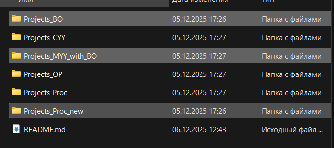

# Что скачивать?

[📦 Скачать файлы курсовой работы (заготовки преподавателя)](https://disk.yandex.ru/d/Mtw9-USZoqF0Qw)

В архиве `cursovaya_files.zip` содержится тестовый проект, с которого можно начать работать над своим вариантом курсовой работы.

Кнопка скачивания в верху страницы.

**Важно:** По мнению экспертов (один студент), для выполнения курсовой работы необходимы только три папки, выделенные на изображении выше. Тем не менее в данном архиве представлены все файлы и папки, но для курсовой работы достаточно использовать только указанные три папки.

:::warning Необходимо реализовать
Для удобства работы и отслеживания версий файлов **необходимо в кратчайшие сроки реализовать git-ссылки на файлы**. Это позволит:

- Отслеживать изменения в файлах проекта
- Работать с версионированием кода
- Упростить совместную работу над проектом
- Обеспечить возможность отката к предыдущим версиям

Рекомендуется создать отдельные git-репозитории для каждой из трех необходимых папок или организовать монорепозиторий с четкой структурой.
:::

Кнопка скачивания в верху страницы.

