# СПОСОБЫ И МЕХАНИЗМЫ АДРЕСАЦИИ

Понятия и термины, используемые для обозначения способов адресации, возникли на практике, и истолкования их не всегда однозначны, а иногда противоречивы. Названия одних и тех же методов адресации у различных семейств машин чаще всего не совпадают. Поэтому при выполнении технического задания следует руководствоваться описанием, приводимым ниже.
Большинство способов адресации связано с необходимостью вычисления адреса оперативной памяти (ОП), по которому производится фактическое обращение к ней. Этот адрес называют исполнительным. Рассмотрим способы адресации, используемые в современных ЭВМ.

Прямая адресация. В данном способе адресации код адреса в команде является исполнительным адресом обращения к памяти. В некоторых ЭВМ используют короткую прямую адресацию, обеспечивающую доступ к ограниченной части адресного пространства. Например, короткий адрес может быть расширен до полного с использованием его старшего разряда, т.е. недостающие старшие разряды принимают значения, равные значению старшего разряда короткого адреса. Таким образом, становится возможным задавать любую ячейку ОП в верхней или нижней части адресного пространства объемом  байт (рис. П.1, а, б).

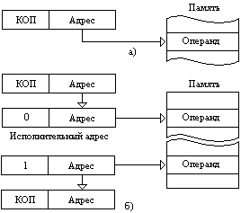

Рис. П.1. Прямая адресация: а - длинная, б - короткая

Регистровая адресация. Это частный случай прямой адресации. Поле адреса команды содержит номер регистра, в котором хранится операнд (рис. П.2).

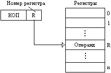

Рис. П.2. Регистровая адресация

Неявная адресация. В команде не содержится явных указаний об адресе участвующего в операции операнда или адреса, по которому помещается результат операции, но этот адрес подразумевается, Например, команда может содержать адреса обоих операндов, участвующих в операции, при этом подразумевается, что результат операции помещается по адресу одного из операндов, или команда указывает только адрес одного операнда, а адрес второго, которым является содержимое специального регистра (называемого регистром результата или аккумулятором), подразумевается.

Непосредственная адресация. В этом способе адресации операнд является составной частью команды (рис. П.3).

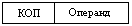

Рис. П.3. Непосредственная адресация

Косвенная адресация. Как показано на рис.П.4, при этом способе адресации в качестве исполнительного адреса используется содержимое ячейки памяти, задаваемой в команде прямым адресом. Таким образом, косвенная адресация может быть определена как «адресация адреса». На косвенную адресацию указывает либо код операции команды, либо значение специального разряда (признака адресации). Цифра «0» или «1» в нем указывает, является адресная часть команды прямым адресом или косвенным.

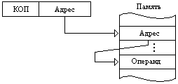

Рис. П.4. Косвенная адресация

Многоступенчатая косвенная адресация. В этом случае ячейка памяти содержит также разряд-признак косвенной адресации. Если этот разряд указывает на продолжение косвенной адресации, то устройство управления последовательно выбирает из памяти адреса до тех пор, пока не будет найдена ячейка, в которой разряд-признак определит прямую адресацию. Адрес из этой последней ячейки и является искомым исполнительным адресом (рис. П.5).

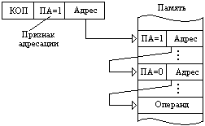

Рис. П.5. Многоступенчатая косвенная адресация

Косвенная регистровая адресация. В данном способе адресации исполнительный адрес извлекается не из оперативной памяти, а из внутреннего регистра процессора (рис. П.6).

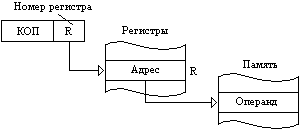

Рис. П.6. Косвенная регистровая адресация

Автоинкрементная и автодекрементная адресации. Данные способы адресации можно рассматривать как упрощенный вариант индексации - важного механизма преобразования адресных частей команд и организации вычислительных циклов, поэтому их часто называют автоиндексацией. Автоиндексация прибавлением называется инкрементной, вычитанием - декрементной. Приращение или убавление адреса может производиться либо перед выборкой содержимого ячейки ОП, либо после выборки.
В наиболее распространенном случае автоинкрементная адресация обеспечивает вычисление исполнительного адреса, как и при косвенном регистровом способе, а затем автоматически увеличивает содержимое регистра на размер операнда (рис. П.7). Например, в ЭВМ с побайтовой адресацией содержимое регистра необходимо увеличить на 1, чтобы указать адрес очередного байта, и на 2, если операнд занимает два байта. Размер операнда можно определить, исходя из кода операции команды.

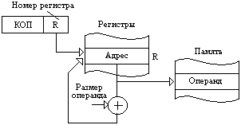

Рис. П.7. Автоинкрементная адресация (вариант 1)

Приращение адреса перед выборкой содержимого ячейки ОП показано на рис. П.8.

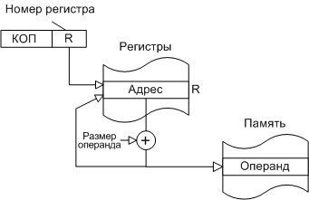

Рис. П.8. Автоинкрементная адресация (вариант 2)

Автодекрементная адресация аналогична автоинкрементной и обеспечивает вычитание размера операнда из содержимого адресного регистра. В наиболее распространенном случае при этом способе адресации вычитание выполняется до использования содержимого регистра в качестве исполнительного адреса (рис.П.9).

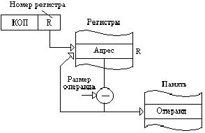

Рис. П.9. Автодекрементная адресация (вариант 1)

Уменьшение адреса после выборки содержимого ячейки ОП показано на рис. П.10.

Рис. П.10. Автодекрементная адресация (вариант 2)

Косвенная автоинкрементная и автодекрементная адресации. При косвенной автоинкрементной адресации косвенный адрес определяется содержимым регистра, номер которого указан в команде. Исполнительный адрес выбирается из ячейки памяти по косвенному адресу. Содержимое регистра увеличивается на 1. 	Варианты косвенной автоинкрементной адресации показаны на рис. П.11– П12.

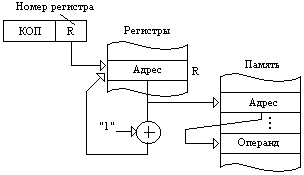

Рис. П.11. Косвенная автоинкрементная адресация (вариант 1)

Рис. П.12. Косвенная автоинкрементная адресация (вариант 2)

В случае косвенной автодекрементной адресации содержимое регистра уменьшается на 1, затем образованный косвенный адрес выбирается из регистра, а исполнительный адрес - из ячейки памяти по косвенному адресу (рис. П.13).

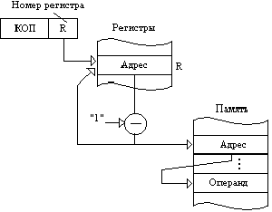

Рис. П.13. Косвенная автодекрементная адресация (вариант 1)

В другом варианте косвенной автодекрементной адресации косвенный адрес определяется содержимым регистра. Исполнительный адрес выбирается из ячейки памяти по косвенному адресу. Содержимое регистра уменьшается на 1 (рис. П.14).

Рис. П.14. Косвенная автодекрементная адресация (вариант 2)

Индексная адресация (адресация с индексированием). При способе адресации с индексированием в команде указываются фиксированный базовый адрес (аналогично прямому способу адресации) и номер регистра, в котором хранится смещение (индекс). Команда, как правило, располагается в двух смежных ячейках ОП. Исполнительный адрес формируется сложением базового адреса и смещения, хранимого в адресуемом регистре (рис. П.15).

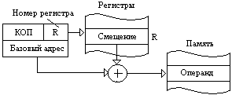

Рис. П.15. Индексная адресация

Базовая адресация (адресация по базе). Способ адресации по базе схож со способом адресации с индексированием. В рассмотренном способе адресации с индексированием команда содержит базовый адрес, а в индексном регистре находится смещение. При адресации по базе наоборот - команда содержит смещение, а в адресном (или базовом) регистре размещен базовый адрес. Исполнительный адрес формируется также сложением базового адреса и смещения (рис. П.16). Смещение может быть как положительным, так и отрицательным.

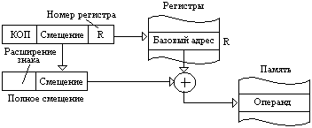

Рис. П.16. Базовая адресация

Базовый адрес всегда является полным адресом, в то время как смещение может быть коротким или длинным. Если смещение и базовый адрес имеют одинаковую длину, то оба способа адресации неразличимы. Их различие очевидно, когда используются короткие смещения.

Базовая адресация с индексированием. Вычисление исполнительного адреса при базовой адресации с индексированием показано на рис. П.17. Исполнительный адрес формируется сложением содержимого базового регистра с содержимым индексного регистра и смещения, указанного в команде.

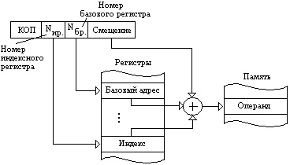

Рис. П.17. Базовая адресация с индексированием (вариант 1)

Для микроЭВМ, оперирующих с короткими словами, в формате команды указываются только номера индексного и базового регистров, смещение отсутствует. Исполнительный адрес получается сложением содержимого индексного и базового регистров (рис. П.18).

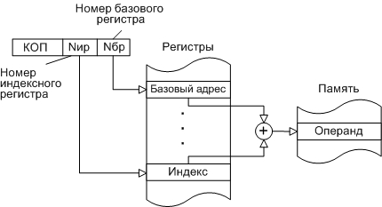

Рис. П.18. Базовая адресация с индексированием (вариант 2)

Относительная адресация. Адресацию, при реализации которой исполнительный адрес вычисляется как сумма смещения со знаком, заданного непосредственно в команде, и текущего значения счетчика команд, называют относительной адресацией (рис. П.19). Когда выполняется сложение с содержимым счетчика команд, последний уже указывает адрес очередной команды. Относительная адресация используется при выполнении команд управления (условные и безусловные переходы, вызовы подпрограмм, управление циклами и т.д.), чтобы адресовать ячейку памяти, содержащую следующую команду.

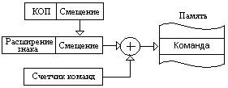

Рис. П.19. Относительная адресация

Косвенная относительная адресация. Этот способ адресации отличается от относительной тем, что вычисленный рассмотренным только что способом адрес является не исполнительным адресом а косвенным адресом операнда, т.е. адресом, по которому из памяти извлекается исполнительный адрес (рис. П.20).

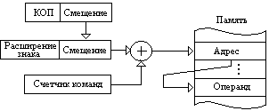

Рис. П.20. Косвенная относительная адресация

Относительная адресация с индексированием. В этом способе адресации базовым адресом является содержимое счетчика команд, а в команде указываются смещение и номер регистра, который содержит дополнительное смещение (индекс). Исполнительный адрес формируется суммированием содержимого счетчика команд, смещения и индекса (рис. П.21).

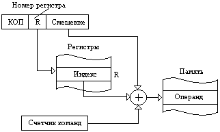

Рис. П.21. Относительная адресация с индексированием

Прединдексная косвенная адресация. В данном способе адресации индексируется базовый адрес, заданный в команде. Прединдексация - это индексация до косвенной адресации. Базовый адрес суммируется с содержимым индексного регистра, номер которого также указан в команде. Полученный таким образом адрес является косвенным адресом, по которому из ОП выбирается исполнительный адрес операнда (рис. П.22).

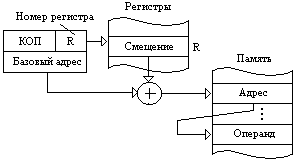

Рис. П.22. Прединдексная косвенная адресация (вариант 1)

В другом варианте прединдексной косвенной адресации в формате команды указываются номер базового регистра и смещение. Смещение суммируется с содержимым базового регистра для формирования косвенного адреса; содержимое ячейки ОП ос косвенным адресом является исполнительным адресом (рис. П.23).

Рис. П.23. Прединдексная косвенная адресация (вариант 2)

Постиндексная косвенная адресация. В этом случае индексируется заключительный адрес, хранящийся а ячейке ОП или в одном из регистров и указывающий ячейку, в которой содержится операнд или должен запоминаться результат. Постиндексация - это индексация после косвенной адресации. По базовому адресу, указанному в команде, из ячейки ОП извлекается адрес, к нему прибавляется содержимое индексного регистра. Полученная сумма будет исполнительным адресом операнда (рис.П.24).

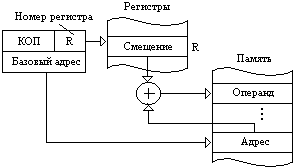

Рис. П.24. Постиндексная косвенная адресация (вариант 1)

В другом варианте постиндексной косвенной адресации в команде указываются номер базового регистра и смещения. Базовый адрес используется в качестве косвенного адреса; смещение прибавляется к содержимому ячейки с косвенным адресом, чтобы получить требуемый исполнительный адрес (рис. П.25).

Рис. П.25. Постиндексная косвенная адресация (вариант 2)

Обычно в ЭВМ одновременно используется несколько способов адресации. Способ адресации указывается либо неявно кодом операции, либо в явной форме в специальном поле адресной части команды.

